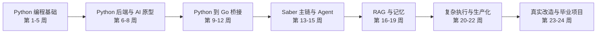

# AGI-saber 零基础 24 周学习计划

> 路线版本：Python 主线 + Go 项目过渡版（2026-07-10 统一修订）
>
> 适用对象：编程基础较弱，希望先用 Python 建立编程和 AI 直觉，最终能够读懂、运行、调试并修改 Go 项目 AGI-saber。
>
> 时间预算：每天 6 小时，每周学习 6 天，休息 1 天；共 24 周，约 864 小时。
>
> 语言边界：第 1-8 周只学习和使用 Python；第 9 周开始学习最小必要 Go；第 12 周开始启动和映射 AGI-saber。

## 1. 为什么采用 Python 主线

Agent 开发不强制使用 Go。Python 更适合零基础入门，也更适合快速验证 LLM、Embedding、RAG、Tool Calling 和 ReAct。

但 AGI-saber 的后端源码是 Go，因此完全绕过 Go 会导致三个问题：

1. 只能使用项目，不能真正阅读项目。
2. 遇到报错时无法沿源码定位。
3. 无法给项目增加工具、接口、测试或修复。

因此本路线采用：

```text
Python 建立编程能力
    ↓
Python 实现 AI 最小原型
    ↓
学习最小必要 Go
    ↓
把 Python 中理解的概念映射到 AGI-saber
    ↓
修改和测试真实 Go 项目
```

Python 是第一语言，Go 是项目语言。前期不同时深入两门语言。

## 2. 本地环境与项目现状

### 当前电脑

- Python 3.12.10 已安装。
- pip 已安装并可用。
- Git 已安装。
- Docker 客户端已安装。
- Go 当前不在 PATH 中，第 9 周再安装 Go 1.25.x。

### 本地知识库

- `yuque_agi_core/docs` 中有 97 篇文档。
- 主线材料包括 Agent、RAG、记忆、工具调用、MCP、ReAct、Harness、上下文工程和 AGI-saber 架构。
- 面试资料放在后期使用。前期不以背题为目标。

### AGI-saber 当前源码

- 路径：`projects/AGI-saber-main`
- 语言：Go
- `go.mod` 要求 Go 1.25.0。
- 当前规模约 16,227 行 Go 代码、107 个 Go 文件、18 个测试文件。
- 当前入口是 `cmd/server/main.go`。
- 当前运行命令应为 `go run ./cmd/server`。
- 项目包含 Chat、Tool、RAG、ReAct、Prompt Context、五种记忆、知识图谱、子 Agent、文档库、沙箱、认证、SSE、日志和持久化。

## 3. 24 周后的目标

你应当能够：

1. 使用 Python 独立写中小型命令行程序和 HTTP 服务。
2. 用 Python 实现最小 LLM 客户端、向量检索、RAG、工具调用和 ReAct。
3. 阅读 Go 中的函数、结构体、接口、错误、goroutine、context 和测试。
4. 独立运行 AGI-saber，并知道配置、端口、数据库和 API Key 的作用。
5. 从 `POST /api/chat` 追踪到 `prepare -> dispatch -> finalize`。
6. 解释 Chat、Tool、RAG、ReAct 四种模式如何路由。
7. 解释父子切分、Embedding、BM25、知识图谱、RRF、Rewrite 和 Rerank。
8. 解释五种记忆的职责、生命周期和读写流程。
9. 给 AGI-saber 增加一个工具、补单元测试并调试接口。
10. 完成“上传文档 -> 检索 -> 子 Agent 研究 -> 写报告 -> 保存 -> 重新入库”的综合项目。

## 4. 总体路线



时间分配：

| 阶段 | 周数 | 约投入 |
|---|---:|---:|
| Python 编程基础 | 5 周 | 180 小时 |
| Python 后端与 AI 原型 | 3 周 | 108 小时 |
| Go 桥接与项目启动 | 4 周 | 144 小时 |
| Agent 与 Saber 主链 | 3 周 | 108 小时 |
| RAG 与记忆 | 4 周 | 144 小时 |
| 复杂执行与生产化 | 3 周 | 108 小时 |
| 真实改造与毕业项目 | 2 周 | 72 小时 |

## 5. 每天 6 小时怎么安排

休息时间不计入 6 小时。

| 学习块 | 时长 | 内容 |
|---|---:|---|
| 概念课 | 1.5 小时 | 学习 1-2 个新概念，画图和做少量笔记 |
| Python 或 Go 编码 | 1.5 小时 | 跟写示例，再独立重写 |
| 项目实战 | 2 小时 | 小项目、AGI-saber 源码映射、调试或测试 |
| 复盘验收 | 1 小时 | 错题、闭卷口述、测试、学习日志 |

建议每 50 分钟休息 10 分钟，不建议把 6 小时全部安排在晚上。

## 6. 每周固定节奏

“固定节奏”只规定每天的学习方式，不替代后面的具体课名。具体主题以逐周计划、学习区 `README.md` 和当天 `LESSON.md` 为准。

| 天 | 固定任务 |
|---|---|
| Day 1 | 学习第一个核心主题，跟写最小示例 |
| Day 2 | 学习第二个核心主题，完成分层练习 |
| Day 3 | 学习第三个核心主题，把前两天知识组合起来 |
| Day 4 | 补齐本周最后一个主题，做综合遍历、重构或映射 |
| Day 5 | 完成本周小项目，处理输入、边界和错误 |
| Day 6 | 闭卷复述、排错、周测和整理总结 |
| Day 7 | 休息，最多轻量回顾 30-60 分钟 |

从第 9 周开始，每个项目概念采用“三步映射法”：

1. 用 Python 写最小版本。
2. 用图说明数据怎样流动。
3. 在 AGI-saber 中找到对应的 Go 文件、类型和函数。

## 7. 24 周逐周计划

### 阶段一：Python 编程基础

| 周次 | 本周主题 | 学习内容 | 实战产出与过关标准 |
|---|---|---|---|
| 第 1 周 | Python 运行基础与程序控制 | 文件、目录、解释器、进程、工作目录；变量、基础类型、输入输出、类型转换；判断、循环、函数、作用域；`try/except` 入门与排错 | 能从终端运行 Python；完成学习进度管理器；能解释源码、进程、分支、循环、参数和返回值 |
| 第 2 周 | 字符串、容器与结构化数据 | 字符串、索引、切片、清洗；list、tuple、dict、set；增删改查、遍历、解包、去重、推导式入门；用“列表中放字典”建模 | 完成内存版联系人管理系统；能根据需求选择字符串、列表、元组、字典或集合 |
| 第 3 周 | 模块、异常、文件与 JSON | import、模块、包、路径；异常捕获与主动抛出；文本和 JSON 读写、编码、上下文管理器；把数据保存到磁盘 | 把联系人系统拆成至少 3 个模块并支持 JSON 持久化；能处理文件不存在和数据损坏 |
| 第 4 周 | 类、dataclass 与数据建模 | 对象、class、属性、方法、构造函数、dataclass、组合；从字典模型过渡到对象模型；职责拆分 | 完成面向对象任务管理器；能解释函数、字典记录、类和对象分别解决什么问题 |
| 第 5 周 | Python 工程化与阶段测评 | 虚拟环境、pip、Git 基础、`.gitignore`、类型标注、日志、pytest、断点调试、配置与环境变量；同步和异步的初步区别 | 给任务管理器补至少 8 个测试；完成一次 Git 提交练习；密钥不能写死；通过阶段测评一 |

第 1 周不再安排 Git。Git 不影响 Day 1-3 的 Python 理解，统一放到第 5 周工程化阶段系统学习。

### 阶段二：Python 后端与 AI 原型

| 周次 | 本周主题 | 学习内容 | 实战产出与过关标准 |
|---|---|---|---|
| 第 6 周 | HTTP、JSON 与 Python Web 服务 | HTTP 请求和响应、方法、状态码、Header、JSON、REST；用 Python 写 API；中间件和流式输出的概念 | 写一个包含增删改查接口的小型 Web 服务；会用脚本或 Postman 调接口 |
| 第 7 周 | SQL、PostgreSQL 与 Docker | 表、主键、索引、CRUD、事务基础、参数化查询；Repository 思想；镜像、容器、端口、volume、Compose | Python 服务接 PostgreSQL；Docker 启动数据库；能查看日志和定位端口占用 |
| 第 8 周 | LLM、Embedding 与最小 RAG | Token、上下文窗口、Prompt、temperature、结构化输出；向量、余弦相似度；切分、Embedding、Top-K、上下文注入 | 用 Python 写最小 LLM 客户端和本地 RAG；至少使用 5 篇文档进行问答实验；阶段测评二 |

### 阶段三：Python 到 Go 的项目桥接

| 周次 | 本周主题 | 学习内容 | Python 到 Go 映射 | 过关标准 |
|---|---|---|---|---|
| 第 9 周 | Go 最小语法 | 安装 Go 1.25.x；package、main、变量、类型、`if`、`for`、函数、多返回值、slice、map | Python 函数/list/dict 对应 Go 函数/slice/map | 能把第 1 周学习计时器和第 2 周联系人核心逻辑改写成 Go |
| 第 10 周 | Struct、Interface 与 Error | struct、method、pointer、interface、error、`defer`、包可见性、module、JSON/YAML | Python class/duck typing/exception 对应 Go struct/interface/error | 能读懂 `domain/tool` 和 `domain/sandbox`；写一个 Go 工具注册表 |
| 第 11 周 | 并发、Context 与测试 | goroutine、channel、WaitGroup、Mutex/RWMutex、context 取消和超时、table-driven test；DAG 与拓扑排序 | Python async/threading 的直觉对应 Go 并发原语 | 写并发任务执行器；支持超时取消；至少写 5 个 Go 测试 |
| 第 12 周 | AGI-saber 启动与分层架构 | HTTP Handler、domain/application/infrastructure、依赖注入、配置、日志、JWT、优雅降级和优雅关停 | 把 Python Web 服务的层次映射到 Saber | 成功启动项目；调通注册、登录、状态和聊天接口；画当前源码全景图 |

### 阶段四：Agent 与 AGI-saber 主调用链

| 周次 | 本周主题 | 知识库材料 | Python 原型 | AGI-saber 源码 | 过关标准 |
|---|---|---|---|---|---|
| 第 13 周 | Tool Calling 与 MCP | 文档 019、020、045、046 | 写工具 Schema、注册表、参数校验和执行回传 | `domain/tool`、`infrastructure/tool`、`tool_registry.go`、`mode_tool.go` | 能解释原生 Function Calling、Saber JSON 方案和 MCP 的区别 |
| 第 14 周 | ReAct、DAG 与 Harness | 文档 021-024、030、073 | 写 Planner -> Executor -> Observation -> Generator 玩具循环 | `plan_graph.go`、`runtime_graph.go`、`mode_react.go`、`replanner.go` | 完成 3 节点 DAG；支持依赖、重试、超时和停止条件 |
| 第 15 周 | 一轮请求的完整生命线 | 文档 011、020；项目 `chat/doc.md` | 用 Python 写 `prepare -> route -> dispatch -> finalize` 简化版 | `handler.go`、`core_agent.go`、`runtime_process.go`、`infra_router.go`、`ctx_*` | 从 `/api/chat` 追到响应；用日志验证 Chat、Tool、RAG、ReAct 四种模式 |

### 阶段五：RAG 与记忆

| 周次 | 本周主题 | 知识库材料 | Python 实验 | Go 源码映射 | 过关标准 |
|---|---|---|---|---|---|
| 第 16 周 | RAG 切分与父子索引 | 文档 012-015、052-054 | 实现固定切分、递归切分、Overlap、父子块 | `rag/splitter.go`、`rag/rag.go` | 比较 3 种切分策略；解释 small-to-big |
| 第 17 周 | 混合检索、RRF 与 Rerank | 文档 015-018、050、051、055 | 实现关键词检索、向量检索、RRF 融合和简单重排 | `hybrid.go`、`rewriter.go`、`reranker.go` | 手算 RRF；比较单路和混合检索；给核心算法补测试 |
| 第 18 周 | PDF、知识图谱与 RAG 评测 | 文档 013、016-018；`PDF_INGESTION_PIPELINE.md` | 解析文档元数据，建立简化实体关系；制作评测脚本 | `domain/document`、`domain/knowledge` | 建立 20-30 条评测集；按切分、召回、排序、生成归因失败 |
| 第 19 周 | 五种记忆与上下文工程 | 文档 025-029、062、064、065 | 实现短期窗口、偏好字典、长期检索和任务缓冲 | `domain/memory`、`domain/promptctx`、`poison.go` | 画记忆读写图；解释偏好和长期记忆；运行现有记忆测试 |

### 阶段六：复杂执行与生产化

| 周次 | 本周主题 | 学习重点 | AGI-saber 源码 | 过关标准 |
|---|---|---|---|---|
| 第 20 周 | Saber ReAct 与可靠执行 | Planner 输出清洗、TaskGraph、并行、RaceGroup、超时、重试、取消、快照、Replan、SSE 事件 | `mode_react.go`、`runtime_*`、`replanner.go`、`runtime_task.go` | 跟踪复合任务；制造工具失败并解释恢复或软失败过程 |
| 第 21 周 | 子 Agent 与本地文档库 | research/writer/review/doc 分工；上游结果；版本文档；写入和重新入 RAG | `subagents.go`、`tool_documents.go`、`domain/document` | 完成“研究 -> 写作 -> 审查 -> 保存 -> 入库”完整流程 |
| 第 22 周 | 安全、认证、日志与排错 | 沙箱风险、Docker/Local/Mock；JWT、多租户、CORS、Request ID、日志、pprof、优雅关停、故障注入 | `domain/sandbox`、`interfaces/http`、`pkg/logger` | 完成 5 类故障演练；写一份新手排错 SOP；阶段测评三 |

### 阶段七：真实改造与毕业项目

| 周次 | 本周主题 | 实战要求 | 验收标准 |
|---|---|---|---|
| 第 23 周 | 第一个 AGI-saber 功能改造 | 先用 Python 写 `text_stats` 原型，再在 Go 中实现 Tool 定义、注册、参数校验、错误处理和单元测试 | 测试通过；能在 Tool 和 ReAct 模式调用；能解释每个改动文件 |
| 第 24 周 | 个人文档研究助手 | 上传自己的资料，完成 RAG 检索、子 Agent 研究、报告生成、审查、保存和重新入库；制作评测和架构说明 | 30 条评测集、一份失败分析、一张架构图、一份操作说明、10-15 分钟闭卷讲解 |

## 8. Python 和 Go 的学习边界

### Python 要掌握到什么程度

- 能独立写 500-1000 行的小项目。
- 能拆模块、写测试、处理异常、读取配置和调用 HTTP API。
- 能实现简化版 RAG、Tool Calling 和 ReAct。
- 能看日志、加断点、定位常见错误。

### Go 要掌握到什么程度

- 能读函数、结构体、方法、接口和错误。
- 能理解构造函数与依赖注入。
- 能读 goroutine、Mutex、WaitGroup 和 context。
- 能修改现有代码并补测试。
- 不要求前期掌握 Go 的全部底层细节。

### 前 12 周不要做的事

- 不同时学习 Python、Go、JavaScript 三门语言。
- 不一开始使用多个 Agent 框架。
- 不追求从零训练模型。
- 不深挖 CUDA、LoRA、RLHF、PPO、GRPO。
- 不逐行阅读整个 `internal/application/chat`。
- 不先背面试题。

## 9. 阶段关卡

### 第 5 周：Python 编程关

- 能独立写多文件 Python 程序。
- 能使用虚拟环境、日志、配置和 pytest。
- 遇到异常时会读 traceback。

### 第 8 周：Python AI 原型关

- 能调用 LLM API。
- 能解释 Embedding 和余弦相似度。
- 能写一个小型 RAG，并知道答案错误可能出在哪一层。

### 第 12 周：Go 与项目启动关

- 能读懂 Go 中常见类型和接口。
- 能理解项目分层。
- 能运行 AGI-saber 并调用基本接口。

### 第 15 周：Agent 主链关

- 能说出 HTTP -> Agent -> prepare -> route -> dispatch -> finalize。
- 能解释四种模式的分流位置。
- 能将 Python 原型与 Go 实现一一对应。

### 第 19 周：RAG 与记忆关

- 能解释 RRF、small-to-big 和 Rerank。
- 能对 RAG 错误回答做归因。
- 能解释五种记忆的职责和生命周期。

### 第 22 周：生产工程关

- 能定位超时、工具失败、数据库不可用、权限失败和错误配置。
- 能解释 Agent 为什么需要 Harness、沙箱、认证、日志和评测。

### 第 24 周：独立项目关

- 能改 Go 功能、写测试、调接口、看日志和做评测。
- 能从用户需求讲到架构，再讲到代码。

## 10. 每周评分

总分 100 分：

| 项目 | 分数 | 判断方式 |
|---|---:|---|
| 概念理解 | 20 | 不看资料回答 5 个核心问题 |
| 编码练习 | 30 | 小程序能运行并处理边界情况 |
| 知识迁移与项目映射 | 25 | 第 1-8 周检查 Python 应用；第 9 周后检查 Python、Go 和项目映射 |
| 测试与调试 | 15 | 完成测试、断点或故障演练 |
| 学习输出 | 10 | 一页总结、一张图或 5 分钟口述 |

节奏规则：

- 连续两周达到 85 分以上，可以适度加速。
- 70-84 分，按正常速度继续。
- 60-69 分，增加 2 天复习。
- 60 分以下，暂停新内容，重做本周最小项目。

## 11. 前两周逐日安排

本节课名与 `learning/python-basics/README.md` 保持一致。详细讲解、6 小时分块和练习，以每天目录中的 `LESSON.md` 为准。

### 第 1 周 Day 1：文件、解释器、进程与第一个 Python 程序

- 30 分钟：阅读本计划和项目顶层目录。
- 60 分钟：验证 Python 和 pip，认识终端。
- 90 分钟：学习 PowerShell 路径、目录和文件命令。
- 90 分钟：创建并运行第一个 Python 文件。
- 60 分钟：认识源码、解释器、程序、进程和工作目录的区别。
- 30 分钟：写学习日志。

### 第 1 周 Day 2：变量、类型、输入与输出

- 学习整数、小数、字符串、布尔值和 `None`。
- 学习变量、`print()`、`input()` 和 f-string。
- 完成 8-10 个小练习。
- 实战：学习时长计算器。

### 第 1 周 Day 3：判断与循环

- 学习 `if/elif/else`。
- 学习 `for`、`while` 和 `range()`。
- 实战：猜数字游戏。
- 验收：能解释程序为什么会进入某个分支。

### 第 1 周 Day 4：函数

- 学习函数、参数、返回值和作用域。
- 把前两天的重复代码提取成函数。
- 实战：成绩统计程序。
- 验收：能区分“调用函数”和“定义函数”。

### 第 1 周 Day 5：第一个完整小程序

- 编写命令行学习计时器。
- 支持添加学习记录、计算完成率和查看当天总结。
- 加输入错误处理。
- 测试正常输入、非法输入和边界值。

### 第 1 周 Day 6：复习、排错与周测

- 闭卷复述本周术语。
- 画出“Python 文件 -> 解释器 -> 进程 -> 输出”的流程图。
- 完成 10 道概念题和 3 道编码题。
- 浏览 AGI-saber 顶层目录，但不读复杂业务源码。

### 第 2 周 Day 1：字符串、索引、切片与文本清洗

- 学习字符串序列、正负索引、切片和不可变性。
- 使用 `strip()`、`lower()`、`split()`、`join()` 等方法清洗文本。
- 完成文本分析器，建立 Agent 输入预处理直觉。

### 第 2 周 Day 2：列表与批量数据

- 学习列表增删改查、遍历、统计、排序和拷贝。
- 使用 `enumerate()` 处理序号和值。
- 把单个累计值升级为多条学习记录。

### 第 2 周 Day 3：元组、字典与结构化记录

- 学习元组不可变性、索引、切片和解包。
- 学习字典增删改查、`get()`、`items()` 和嵌套数据。
- 使用“列表中放字典”表示联系人、聊天消息、工具参数和 RAG 结果。
- 补齐 `is None` 与可变默认参数这两个 Python 易错点。

### 第 2 周 Day 4：集合、去重与综合遍历

- 学习集合创建、去重、成员判断和集合运算。
- 比较列表与集合的成员查找直觉。
- 入门列表、字典和集合推导式，并保留等价的普通循环写法。

### 第 2 周 Day 5：联系人管理项目

- 完成联系人添加、列表、查询、修改和删除。
- 处理空输入、重复姓名、找不到联系人等边界情况。
- 数据暂存在内存中；文件和 JSON 持久化留到第 3 周。

### 第 2 周 Day 6：复习与周测

- 画出字符串、列表、元组、字典、集合的选择图。
- 完成容器概念题、编码题和联系人项目验收。
- 不通过时先补对应知识，不提前进入第 3 周。

## 12. 推荐源码阅读顺序

正式进入项目后，只走这条主线：

1. `cmd/server/main.go`
2. `internal/interfaces/http/handler/handler.go`
3. `internal/application/chat/core_agent.go`
4. `internal/application/chat/runtime_process.go`
5. `internal/application/chat/infra_router.go`
6. `internal/application/chat/mode_tool.go`
7. `internal/application/chat/mode_react.go`
8. `internal/domain/rag/doc.md`
9. `internal/domain/memory`
10. `internal/domain/promptctx/doc.md`

每个文件只回答：

1. 它负责什么？
2. 谁调用它？
3. 它调用谁？
4. 输入和输出是什么？
5. 我能否用 Python 写出它的简化版本？

## 13. 学习目录建议

学习代码不要直接堆进 AGI-saber 源码目录。建议使用：

```text
yuque_agi_core/
├── learning/
│   ├── python-basics/
│   ├── python-backend/
│   ├── python-agent-labs/
│   ├── go-bridge/
│   └── weekly-notes/
├── projects/
│   └── AGI-saber-main/
└── AGI_SABER_24_WEEK_STUDY_PLAN.md
```

前 11 周主要在 `learning` 中练习。第 12 周开始运行和映射项目；第 23 周才进行第一个正式功能改造。

## 14. 学习日志模板

每天结束填写：

```text
日期：
今天投入：
今天真正理解的 3 件事：
今天运行成功的代码：
今天遇到的错误：
我是怎么定位的：
仍然不懂的问题：
明天第一件事：
```

每周结束填写：

```text
本周一句话总结：
我能独立完成什么：
我只能看懂但还不会做什么：
当前阶段怎样实现（第 1-8 周写 Python，第 9 周后补 Go）：
AGI-saber 在哪里实现（尚未进入项目时写“暂不映射”）：
本周得分：
下周是否需要降速：
```
