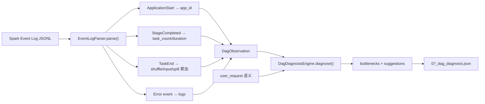
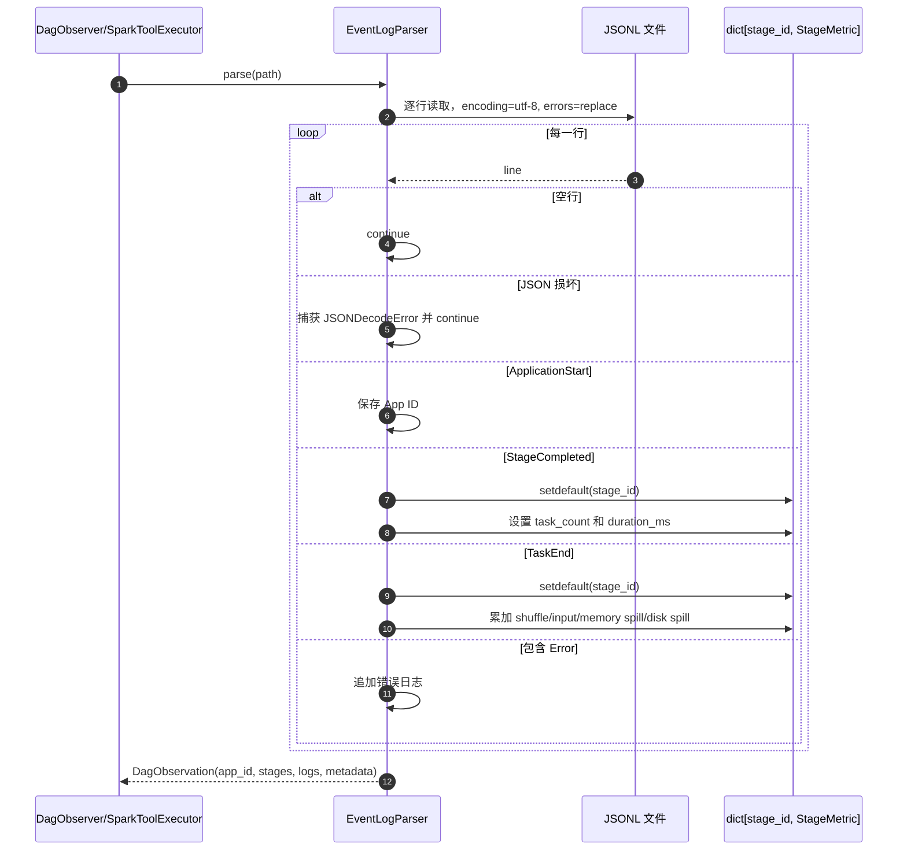
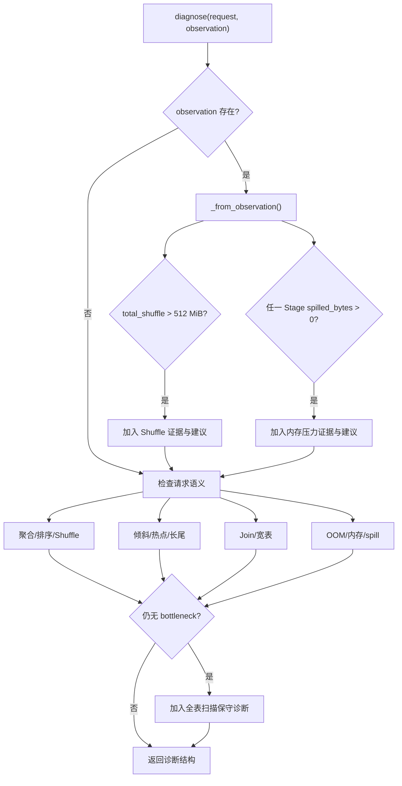
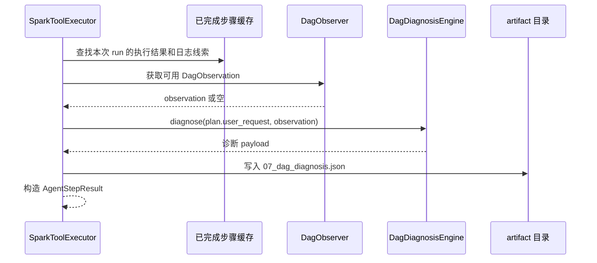

# DAG 观测与大数据性能诊断

- 原始链接: https://www.yuque.com/yuqueyonghu-ng3vtk/agi-saber/um9srmsvawa6kz1f
- Slug: um9srmsvawa6kz1f
- Doc ID: 275535456
- 层级: 3
- 字数: 1103
- 创建时间: 2026-06-28T11:51:41.000Z
- 更新时间: 2026-07-20T08:22:52.000Z
- 发布时间: 2026-07-20T08:22:52.000Z
- 内容更新时间: 2026-07-20T08:22:52.000Z
- 本地同步时间: 2026-10-08T16:25:13+08:00

## 标题结构

- h1: DAG 观测与大数据性能诊断
- h2: 1. 要解决的问题
- h2: 2. 核心数据模型
- h3: StageMetric
- h3: DagObservation
- h2: 3. 从 Event Log 到诊断 artifact
- h2: 4. Event Log 解析细节
- h3: Stage 时长
- h3: Task 指标累加
- h3: 容错策略
- h2: 5. 诊断规则合并
- h2: 6. 规则输出结构
- h2: 7. 与 Spark 执行的连接
- h2: 8. 实现难点与取舍
- h3: Spark 版本兼容
- h3: 倾斜与长尾不能只靠关键词
- h3: 固定阈值缺少上下文
- h3: 优化效果验证
- h2: 9. 源码索引与验证
- h2: 10. 如何向面试官概括

## 资源链接

- [mermaid](https://cdn.nlark.com/yuque/__mermaid_v3/252ebbb138d1ee426289853044144607.svg)
- [mermaid](https://cdn.nlark.com/yuque/__mermaid_v3/5176c647dbbde1f25061b65f5baa3c2c.svg)
- [mermaid](https://cdn.nlark.com/yuque/__mermaid_v3/777266d6371bd4bb14d00912329d63bd.svg)
- [mermaid](https://cdn.nlark.com/yuque/__mermaid_v3/72ffcdd3667df2342c505eb509213061.svg)

## 正文

# DAG 观测与大数据性能诊断

## 1. 要解决的问题

Spark History Server 面向人工查看，Agent 则需要结构化事实。原始 Event Log 是逐事件 JSONL，Stage 完成信息和 Task 指标分散在不同记录中；如果直接把整份日志交给模型，不仅成本高，也容易出现没有证据的诊断。

本实现先把事件归一为 `DagObservation`，再用确定性规则生成带 evidence、impact、priority 和 action 的诊断。LLM 可以在上层总结，但不负责编造指标。

## 2. 核心数据模型

### `StageMetric`

每个 Stage 聚合：

- `stage_id`

- `task_count`

- `duration_ms`

- `shuffle_read_bytes`

- `shuffle_write_bytes`

- `input_rows`

- `spilled_bytes`

### `DagObservation`

保存 application id、Stage 列表、错误日志和数据来源 metadata，并提供总 Shuffle 等派生信息。诊断引擎依赖该领域对象，不依赖 Spark 原始 JSON 字段。

## 3. 从 Event Log 到诊断 artifact

## 4. Event Log 解析细节

### Stage 时长

`_duration()` 使用 Completion Time 减 Submission Time，任一缺失则为 0，并用 `max(0, result)` 防止异常负值。

### Task 指标累加

TaskEnd 事件可能先于 StageCompleted 被读到，因此两条路径都使用 `setdefault()` 创建 StageMetric。Shuffle read 读取 `Remote Bytes Read`，write 读取 `Shuffle Bytes Written`；spill 同时累加内存和磁盘字节。

### 容错策略

损坏 JSON 行被跳过，而不是让整份日志解析失败。这提高了可用性，但当前没有记录“跳过了多少行”，生产环境应把解析错误计数放进 metadata 或监控指标。

## 5. 诊断规则合并

`DagDiagnosisEngine.diagnose(user_request, observation)` 先使用真实 observation，再使用请求语义补充风险。

真实指标和语义规则可能同时生成同类建议，当前没有去重。优点是证据来源完整，缺点是输出可能重复；可以按 `type + action` 聚合，并保留多个 evidence。

## 6. 规则输出结构

每个瓶颈包含：

| 字段 | 含义 |
| --- | --- |
| `type` | shuffle、skew、join、oom 或 scan |
| `evidence` | 指标或请求语义证据 |
| `impact` | 对网络、磁盘、长尾或失败的影响 |

每条建议包含 priority、action、reason 和 example。例如观察到 spill 时，不只建议加内存，还强调减少单 Task 状态和检查 groupByKey/cache/collect。

## 7. 与 Spark 执行的连接

当没有真实 observation 时，产物仍可生成，但它应被理解为静态风险检查，而非运行后结论。

## 8. 实现难点与取舍

### Spark 版本兼容

不同 Spark 版本、压缩 Event Log 和 rolling log 可能改变读取方式或字段结构。当前 parser 针对有限事件字段，需要使用多个 Spark 版本的 fixture 做契约测试，并对未知事件保持忽略。

### 倾斜与长尾不能只靠关键词

当前“倾斜/热点/长尾”主要来自请求语义，尚未采集每个 Task 的 duration、input size 和 shuffle size 分布。真实检测应比较 P50/P95/P99、最大值/中位数比以及热点 partition，才能把“风险提示”升级为“观测结论”。

### 固定阈值缺少上下文

512 MiB Shuffle 对小作业可能很大，对大集群可能正常。生产阈值应按输入量、作业类型、Executor 规格和历史基线动态计算，并输出当前值与基线。

### 优化效果验证

建议本身不是结果。需要对同一 workload 做优化前后对照，同时验证输出行数和关键业务指标一致，再比较耗时、Shuffle、spill、失败率与资源成本。

## 9. 源码索引与验证

- `sparkos/infrastructure/spark/event_log_parser.py`：事件读取与聚合。

- `sparkos/domain/diagnosis.py`：StageMetric 与 DagObservation。

- `sparkos/application/dag_observer.py`：观测入口。

- `sparkos/application/dag_diagnosis.py`：指标与语义规则。

- `sparkos/infrastructure/spark/history_server_client.py`：History Server 客户端。

- `tests/test_workbench.py::test_event_log_parser_extracts_stage_metrics`：Stage 时长、Shuffle 和 spill fixture。

## 10. 如何向面试官概括

> 我没有让模型直接读整份 Spark 日志，而是先把 SparkListener 事件归一成 Stage 指标，再由可解释规则生成证据和建议。当前 Shuffle 和 spill 有真实指标支撑，倾斜与长尾仍主要是风险提示；生产化会补 Task 分位数、动态基线和优化前后回归。
