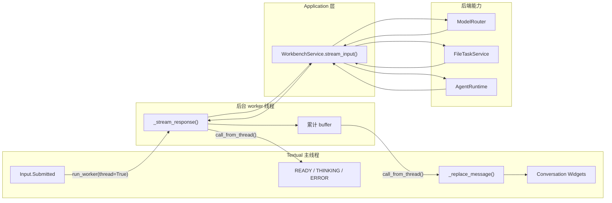
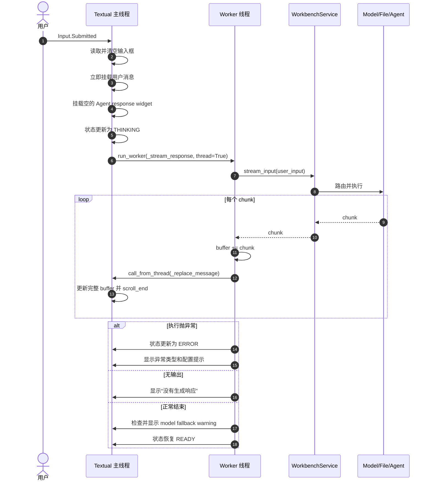
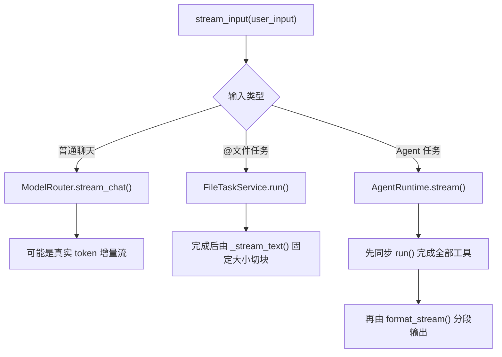
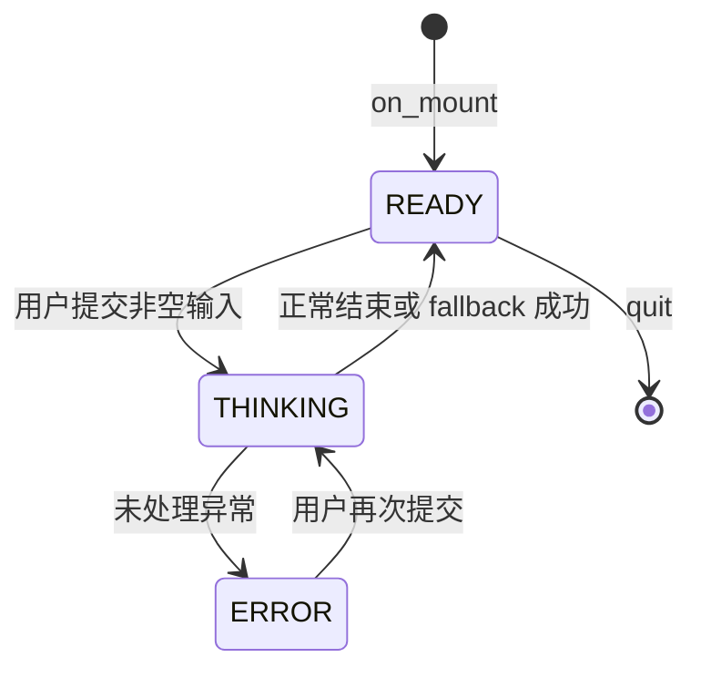

# 面向长任务的 TUI Agent 交互设计

- 原始链接: https://www.yuque.com/yuqueyonghu-ng3vtk/agi-saber/dv629gd47lypayfe
- Slug: dv629gd47lypayfe
- Doc ID: 275535491
- 层级: 3
- 字数: 1142
- 创建时间: 2026-06-28T11:52:05.000Z
- 更新时间: 2026-07-20T08:22:21.000Z
- 发布时间: 2026-07-20T08:22:20.000Z
- 内容更新时间: 2026-07-20T08:22:20.000Z
- 本地同步时间: 2026-10-08T16:25:13+08:00

## 标题结构

- h2: 1. 要解决的问题
- h2: 2. 组件与线程边界
- h2: 3. 一次输入的完整交互
- h2: 4. 统一流接口与三种语义
- h2: 5. 状态栏与模型降级
- h2: 6. 当前并发行为
- h2: 7. 渲染与背压难点
- h3: 累积 buffer 的复制成本
- h3: sleep(0.01) 不是背压
- h3: 取消需要贯穿所有层
- h3: 更合理的事件协议
- h2: 8. 异常路径
- h2: 9. 源码索引
- h2: 10. 如何向面试官概括

## 资源链接

- [mermaid](https://cdn.nlark.com/yuque/__mermaid_v3/21074f6af8678dfd6ea8a6633fff389d.svg)
- [mermaid](https://cdn.nlark.com/yuque/__mermaid_v3/e5abb0ec2d37d115c4d0009805b8137c.svg)
- [mermaid](https://cdn.nlark.com/yuque/__mermaid_v3/a24a8cc7ef3bdc41eb84e567f101571c.svg)
- [mermaid](https://cdn.nlark.com/yuque/__mermaid_v3/4dc232a855fcd44b8755a1d17716fc8c.svg)

## 正文

<a id="rR8ue"></a>
## 1. 要解决的问题


模型请求、文件处理和 Spark Job 都可能阻塞数秒甚至更久。如果在 Textual 事件循环中同步执行，界面会冻结；如果后台线程直接修改 Widget，又会产生线程安全问题。设计目标是让 UI 保持响应，同时让执行逻辑与界面解耦。


<a id="U2Cpp"></a>
## 2. 组件与线程边界





后台线程不能直接操作 Textual Widget。所有 UI 变更都通过 `call_from_thread()` 切回主线程，这是整个设计最关键的线程边界。


<a id="QXbvy"></a>
## 3. 一次输入的完整交互





输入先上屏、再启动后端，因此用户能立即确认请求已接收。`response_widget` 在主线程创建，再作为引用传给 worker；worker 只通过调度回主线程更新它。


<a id="oc6RR"></a>
## 4. 统一流接口与三种语义


`WorkbenchService.stream_input()` 把不同后端统一成 `Iterable[str]`，但三种路径的“流式”含义不同。





因此当前 TUI 的视觉效果都是逐步出现，但只有模型网关路径可能是真正的生成中流式；Agent 不会在每个 Skill 开始或 artifact 创建时实时发事件。


<a id="ivRwE"></a>
## 5. 状态栏与模型降级


状态栏每次更新三个区域：runtime status、model name、累计 used token。`ModelRouter` 在主 provider 异常时保存 `_last_error`，fallback 成功后请求整体不会进入 ERROR，但 `_append_model_warning()` 会追加一条 warning，说明主模型失败和实际降级来源。





<a id="aEslL"></a>
## 6. 当前并发行为


`run_worker(..., exclusive=False)` 允许多个输入并发执行。这不会自动保证业务隔离：


- 每个请求有独立 response widget 和局部 buffer，因此文本一般不会互相覆盖。

- `WorkbenchService`、模型 gateway 和 `AgentRuntime` 是共享实例。

- `SparkToolExecutor._run_results` 是共享可变字典，依赖不同 run_id 隔离。

- SQLite 支持基础串行写入，但高并发锁争用没有治理。

- Spark、模型 API 和 Docker 容器没有统一并发配额。


本项目定位为本地单用户工作台，不能据此声称支持多租户高并发。


<a id="io630"></a>
## 7. 渲染与背压难点


<a id="KnGfF"></a>
### 累积 buffer 的复制成本


每个 chunk 都执行 `buffer += chunk`，然后把完整 buffer 传给 Widget 更新。长文本下可能产生重复字符串复制和重复渲染。可以按时间窗口合并 chunk，例如每 30–50ms 刷新一次。


<a id="sHNq3"></a>
### `sleep(0.01)` 不是背压


它只控制视觉节奏。真正背压需要有界队列：生产者队列满时等待或合并普通 token；状态变更、错误、artifact 等关键事件不能丢弃。


<a id="NdnW8"></a>
### 取消需要贯穿所有层


Textual worker 取消不等于 Spark Job 取消。取消信号需要经过 UI → WorkbenchService → AgentRuntime → JobOrchestrator → Docker/Livy/Spark，并处理取消与成功回调竞态。


<a id="yTuLF"></a>
### 更合理的事件协议


当前所有响应都是字符串。生产化可定义：


```latex
RunEvent = TokenDelta | StepStarted | StepCompleted | ArtifactCreated |
           JobStatusChanged | WarningRaised | RunFailed | RunCompleted
```


TUI、SSE 和 WebSocket 只负责消费同一事件流。这样才能显示真实步骤进度、结构化错误和可点击 artifact，而不是解析字符串。


<a id="Ipwfr"></a>
## 8. 异常路径


- `_stream_response()` 捕获任意异常，切换 ERROR 并展示异常类型。

- `_format_error()` 当前提示检查 master-model 三个配置槽位，适合模型错误，但对文件或 Spark 错误不够精确。

- 主模型失败、fallback 成功不进入 ERROR，而是 READY + warning。

- 空流会显示“没有生成响应”，避免留下永久空白气泡。

- 当前没有超时，阻塞后端可能让 worker 长时间停留在 THINKING。


<a id="QAMB2"></a>
## 9. 源码索引


- `sparkos/interfaces/tui/app.py`：Textual 事件、worker 和 UI 更新。

- `sparkos/application/workbench.py`：统一流接口。

- `sparkos/infrastructure/llm/model_router.py`：真实模型流和 fallback。

- `sparkos/application/agent_runtime.py`：同步执行后格式化。

- `sparkos/interfaces/terminal/chat.py`：同一 Service 的终端适配。

- `tests/test_workbench.py`：聊天与文件任务 chunk 测试。


<a id="V1lGP"></a>
## 10. 如何向面试官概括


> 我把 Textual 主线程和阻塞后端严格分开：worker 执行 Service，所有 Widget 更新通过 call_from_thread 回主线程。统一 Iterable 接口隐藏了后端差异，但我也明确区分了模型真流式、文件切块和 Agent 执行后分段输出。生产化重点是结构化 RunEvent、背压、取消和任务隔离。
