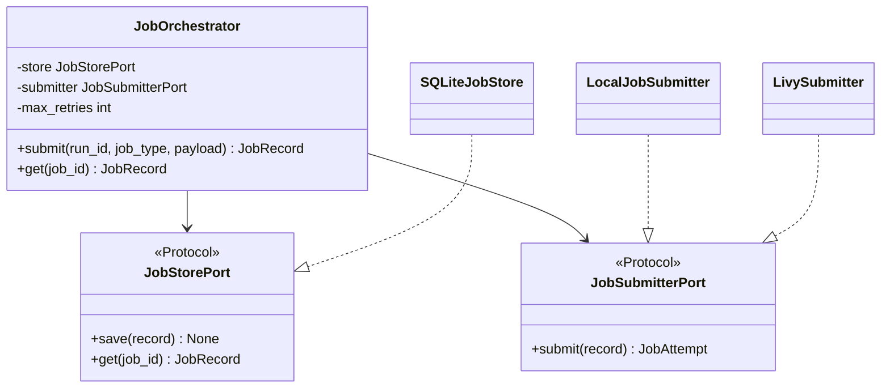
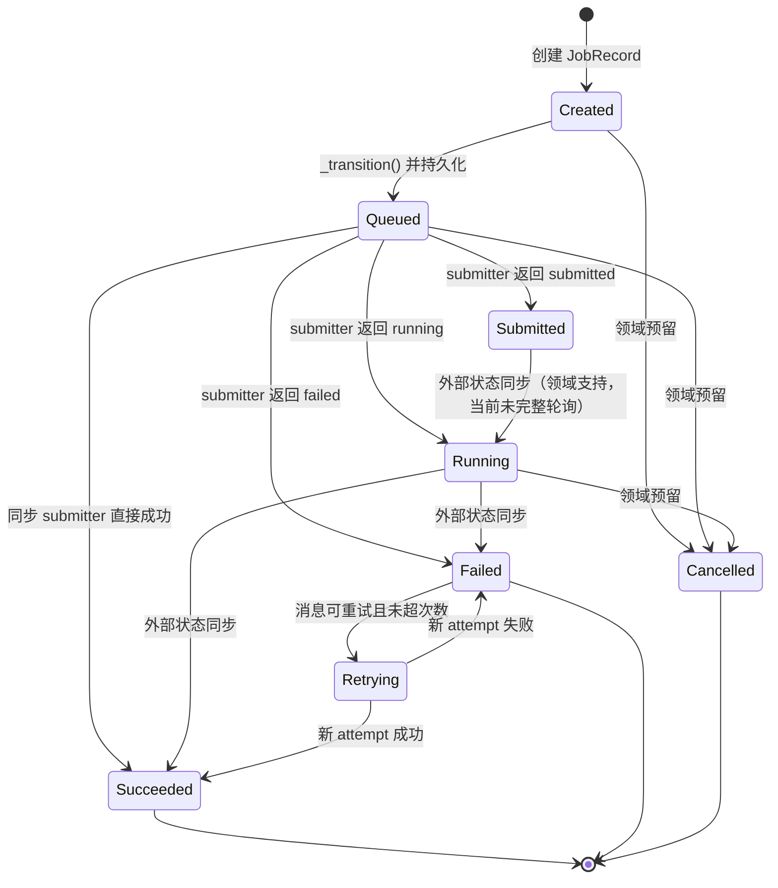
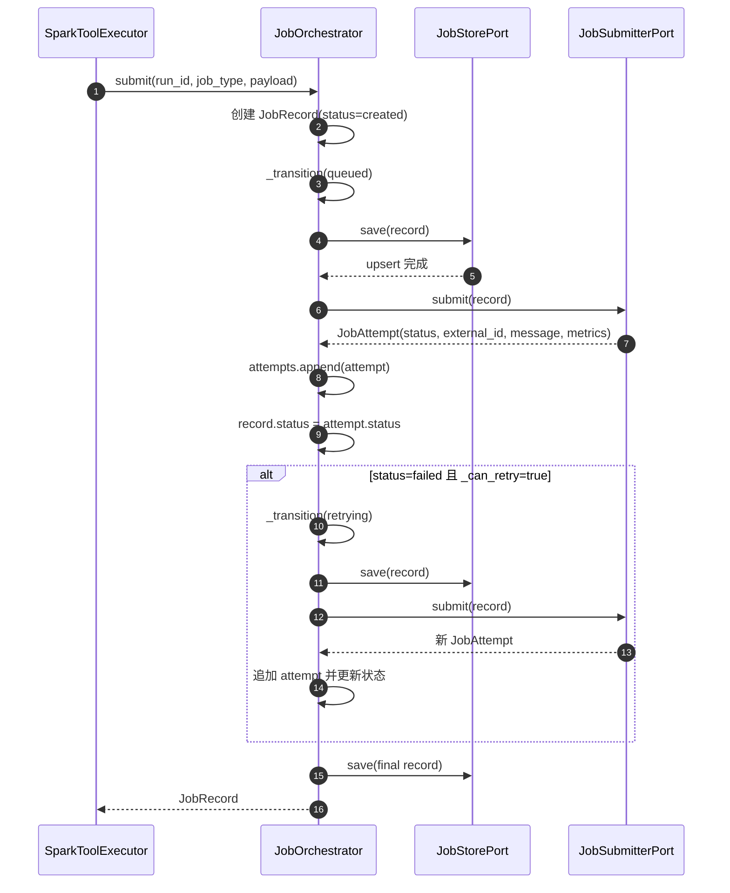
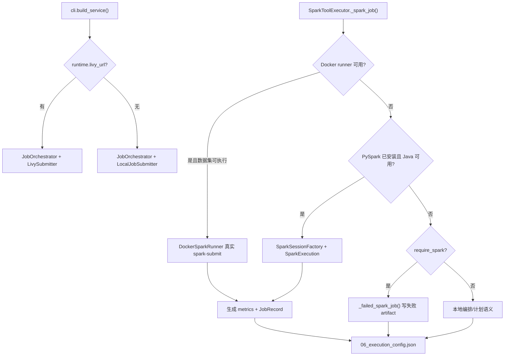

# Spark 执行与任务生命周期管理

- 原始链接: https://www.yuque.com/yuqueyonghu-ng3vtk/agi-saber/gof2573d8ntm48wy
- Slug: gof2573d8ntm48wy
- Doc ID: 275535403
- 层级: 3
- 字数: 1206
- 创建时间: 2026-06-28T11:51:03.000Z
- 更新时间: 2026-07-20T08:21:47.000Z
- 发布时间: 2026-07-20T08:21:46.000Z
- 内容更新时间: 2026-07-20T08:21:46.000Z
- 本地同步时间: 2026-10-08T16:25:13+08:00

## 标题结构

- h1: Spark 执行与任务生命周期管理
- h2: 1. 要解决的问题
- h2: 2. 领域模型与端口
- h3: JobRecord
- h3: JobAttempt
- h3: 两个端口
- h2: 3. 状态模型
- h2: 4. 提交与重试链路
- h3: 重试判断
- h2: 5. SQLite 持久化
- h2: 6. 执行后端选择
- h2: 7. 一致性与恢复难点
- h3: 幂等性
- h3: 提交与落库双写
- h3: 多实例并发
- h3: 重启恢复
- h3: 取消
- h2: 8. 源码索引
- h2: 9. 如何向面试官概括

## 资源链接

- [mermaid](https://cdn.nlark.com/yuque/__mermaid_v3/ea9a07a3a0bd3f8fae83e55d1096cbb8.svg)
- [mermaid](https://cdn.nlark.com/yuque/__mermaid_v3/ffaa2c9756bd2620b83d80ce27bb640f.svg)
- [mermaid](https://cdn.nlark.com/yuque/__mermaid_v3/3b9a13e4fd8e63ba99c62daec0af4987.svg)
- [mermaid](https://cdn.nlark.com/yuque/__mermaid_v3/f020ba55d0ab008058e7b166eaffe362.svg)

## 正文

# Spark 执行与任务生命周期管理

## 1. 要解决的问题

Spark Job 是跨进程、长耗时、有外部 application id 的任务。一次 `spark-submit` 调用不能解决状态持久化、失败重试、服务重启恢复、取消和审计问题。本项目先建立统一 Job 领域模型，再把提交器和存储实现放到端口后面。

## 2. 领域模型与端口

### `JobRecord`

| 字段 | 作用 |
| --- | --- |
| `run_id` | 关联一次 Agent 运行 |
| `job_id` | 系统内部 Job 主键 |
| `job_type` | distributed query、pipeline、graph 或 vector |
| `status` | 当前领域状态 |
| `payload` | 提交参数、SQL、数据集和 Spark 配置 |
| `attempts` | 每次提交尝试的历史 |
| `artifacts` | 与 Job 相关的产物路径 |

### `JobAttempt`

每次尝试保存 attempt 序号、状态、外部 ID、错误信息和 metrics。重试不会覆盖首次失败证据。

### 两个端口

Python Protocol 在运行时不强制继承，图中的实现关系表达结构化契约，而不是显式基类继承。

## 3. 状态模型

领域枚举定义了 `created`、`queued`、`submitted`、`running`、`succeeded`、`failed`、`retrying`、`cancelled`。当前 `JobOrchestrator` 实际主动产生的状态比枚举少：它创建 created，持久化 queued，然后直接采用 submitter 返回的状态；retrying 只在命中可重试失败时出现。

虚线意义上的“外部状态同步”和取消在模型中已表达，但当前尚无完整 watcher/cancel API，面试中不能说已经实现。

## 4. 提交与重试链路

### 重试判断

`_can_retry()` 同时检查：

1. attempt 数量未超过 `max_retries`；

2. 存在 latest attempt；

3. message 中包含 `oom`、`shuffle`、`fetch failed`、`timeout` 或 `transient`。

这是可解释的最小实现，但依赖错误字符串，不如结构化错误码稳定，也没有指数退避和 jitter。

## 5. SQLite 持久化

表结构只有一张 `jobs`：

| 列 | 含义 |
| --- | --- |
| `job_id` | 主键 |
| `run_id` | Agent 运行关联键 |
| `status` | 便于直接查询的冗余状态 |
| `payload_json` | 完整 `JobRecord.model_dump_json()` |
| `updated_at` | 默认更新时间字段 |

`save()` 使用 `INSERT ... ON CONFLICT(job_id) DO UPDATE`。这样同一个 Job 多次状态更新不会新增行。完整领域对象保存在 JSON 中，开发简单，但缺点是很难用 SQL 高效查询 attempt、external_id 和 metrics；生产数据库应把高频查询字段正规化。

注意：当前 upsert 更新语句没有显式更新 `updated_at`，所以默认值只在首次插入时产生。这是现有实现的一个细节缺口。

## 6. 执行后端选择

这里有两个维度：`JobSubmitterPort` 管理 Job 领域提交记录；`DockerSparkRunner`/`SparkExecution` 负责真实计算。当前两者还不是完全统一的异步状态源，生产化时需要以 external_id 为中心收敛。

## 7. 一致性与恢复难点

### 幂等性

当前 `job_id` 使用随机 UUID 片段，同一请求重复调用会创建两个 Job。需要增加业务幂等键，例如 `tenant + task_type + biz_date + request_hash`，并在数据库建立唯一约束。

### 提交与落库双写

外部 Spark 提交成功但最终 `save()` 失败时，可能出现“外部作业在跑、内部无记录”。可采用 transactional outbox：先持久化待提交事件，再由 worker 提交外部系统并回写 external_id。

### 多实例并发

SQLite 适合单机，不适合多个 worker 抢任务。生产实现可用 PostgreSQL 的状态 version 做乐观锁，或 `FOR UPDATE SKIP LOCKED` 抢占 queued Job，确保同一 Job 只有一个执行者。

### 重启恢复

启动时扫描 submitted/running/retrying Job，根据 external_id 查询 Spark/Livy 状态。没有 external_id 的中间状态要结合 outbox 判断是否重提，不能直接把所有 running 标成 failed。

### 取消

领域状态已定义 cancelled，但取消必须贯穿 UI、Orchestrator、submitter 和 Spark 后端；还要处理“取消请求与成功回调同时到达”的竞态。

## 8. 源码索引

- `sparkos/domain/job.py`：状态、JobRecord 和 JobAttempt。

- `sparkos/application/job_orchestrator.py`：状态流转与重试。

- `sparkos/infrastructure/persistence/sqlite_job_store.py`：表结构和 upsert。

- `sparkos/infrastructure/spark/docker_runner.py`：容器执行。

- `sparkos/infrastructure/spark/livy_submitter.py`：远端提交适配器。

- `sparkos/application/spark_execution.py`：计算执行封装。

- `tests/test_workbench.py::test_job_orchestrator_persists_history`：持久化测试。

## 9. 如何向面试官概括

> 我先定义 Job 和 attempt 的领域模型，再用 Store/Submitter Protocol 隔离 SQLite 与 Livy。Orchestrator 持久化 queued 和最终状态，并对 OOM、Shuffle、超时等失败追加重试 attempt。当前是单机原型，生产化的关键不是换数据库这么简单，而是幂等键、外部提交双写、状态并发控制和重启恢复。
