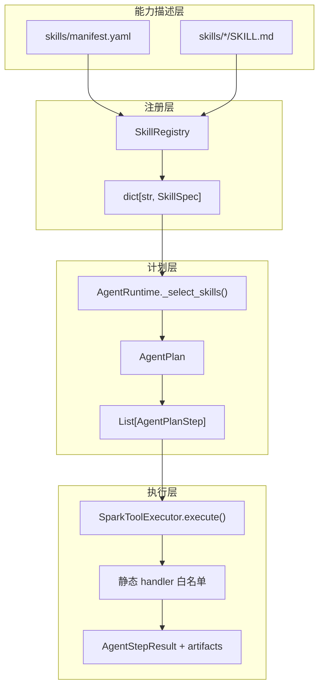
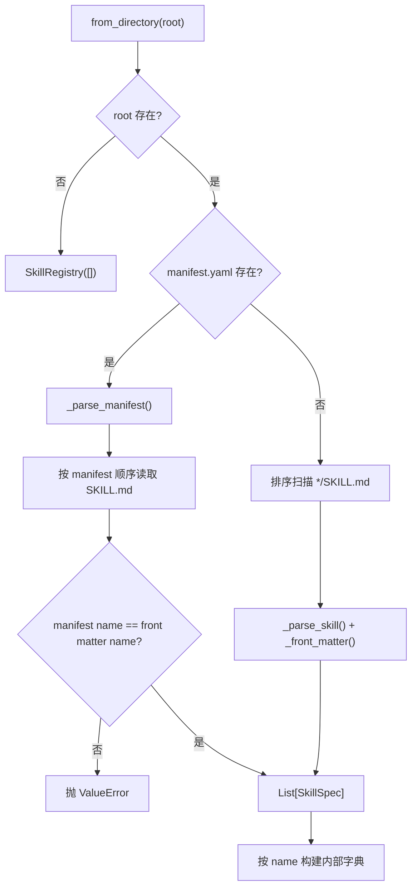
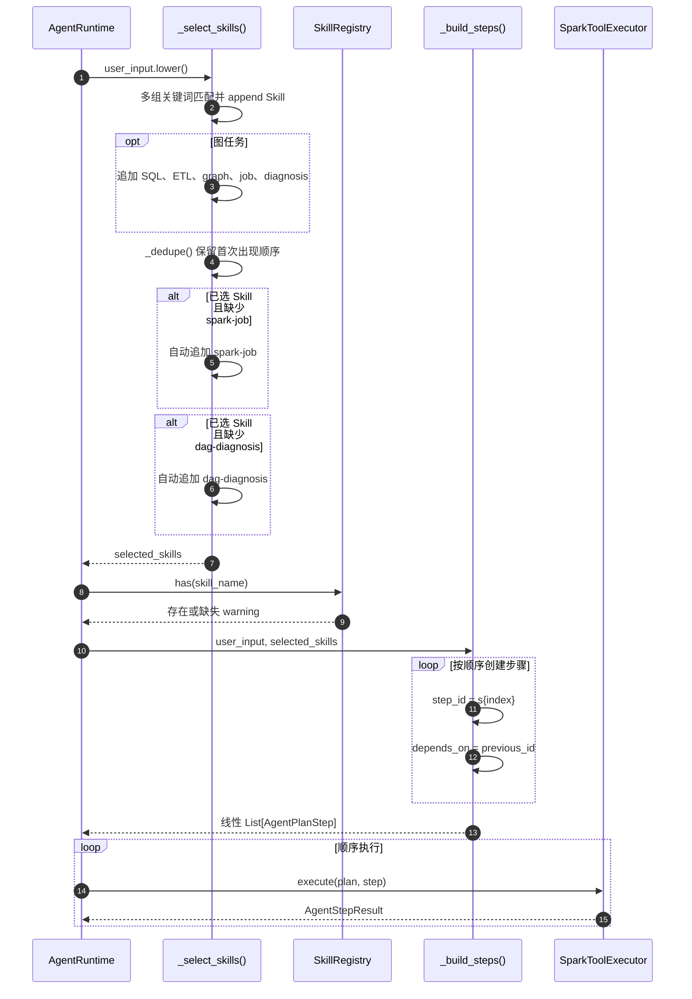
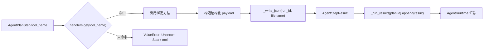

# 可组合 Skill 体系：把数据工程能力模块化

- 原始链接: https://www.yuque.com/yuqueyonghu-ng3vtk/agi-saber/vrnx8ptkp872slft
- Slug: vrnx8ptkp872slft
- Doc ID: 275535340
- 层级: 3
- 字数: 1324
- 创建时间: 2026-06-28T11:50:14.000Z
- 更新时间: 2026-07-20T08:21:08.000Z
- 发布时间: 2026-07-20T08:21:08.000Z
- 内容更新时间: 2026-07-20T08:21:08.000Z
- 本地同步时间: 2026-10-08T16:25:13+08:00

## 标题结构

- h2: 1. 设计目标
- h2: 2. 四层结构
- h2: 3. Skill 加载实现
- h2: 4. 计划协议
- h2: 5. Skill 选择与依赖生成
- h3: 自动追加执行和诊断的含义
- h3: 当前依赖是线性链
- h2: 6. 执行分发与结果收集
- h2: 7. 外置 Skill 与内置 fallback
- h2: 8. 扩展一个 Skill 的实际步骤
- h2: 9. 实现难点与取舍
- h3: 动态扩展与执行安全
- h3: 描述版本与执行版本漂移
- h3: DAG 并行与失败传播
- h3: Planner 的可评测性
- h2: 10. 源码索引
- h2: 11. 如何向面试官概括

## 资源链接

- [mermaid](https://cdn.nlark.com/yuque/__mermaid_v3/e1f1aeb92730095d24b899618b4e7294.svg)
- [mermaid](https://cdn.nlark.com/yuque/__mermaid_v3/7fcff6048c44312844186e28883fbb20.svg)
- [mermaid](https://cdn.nlark.com/yuque/__mermaid_v3/eeb8ab023bbb4442640ac7df4e0e808f.svg)
- [mermaid](https://cdn.nlark.com/yuque/__mermaid_v3/b1a2957251238776b1c90caaab894a55.svg)

## 正文

## 1. 设计目标

如果 SQL、ETL、清洗、质量、特征、执行和诊断全部写进一个 Agent Controller，新增能力会同时修改 Prompt、路由、执行和展示。Skill 体系的目标是把能力描述、计划节点和可信执行拆开，使每一层可以独立扩展和验证。

当前实现选择“外置描述 + 内置白名单执行”，而不是把 Skill 当成可热加载的任意 Python 插件。这个取舍牺牲了一部分动态性，但保留了执行安全和静态可审查性。

## 2. 四层结构

## 3. Skill 加载实现

`SkillRegistry.from_directory(root)` 有两条加载路径：

`_front_matter()` 只解析简单的 `key: value`，并不实现完整 YAML front matter。这足以读取 name 和 description，但复杂嵌套元数据需要改用 YAML parser。

内部结构是 `{skill.name: skill}`，同名项后写覆盖前写。manifest 名称不一致会失败，但当前没有显式检测重复名称。

## 4. 计划协议

`AgentPlanStep` 是 Skill 进入调度层后的统一表示，核心字段包括：

| 字段 | 含义 |
| --- | --- |
| `id` | 运行内步骤编号，如 `s1` |
| `skill_name` | 领域能力名称，如 `data-quality` |
| `tool_name` | handler 名，如 `data_quality` |
| `objective` | 当前步骤目标 |
| `depends_on` | 前置步骤 ID 列表 |

Skill 描述没有直接成为可执行代码。`tool_name` 只是进入白名单 dispatcher 的键，真正逻辑仍在 Python handler 中。

## 5. Skill 选择与依赖生成

### 自动追加执行和诊断的含义

只要匹配到业务 Skill，系统默认追加 `spark-job` 和 `dag-diagnosis`。这样能形成“规划—执行—诊断”闭环，但也有副作用：仅想生成 SQL 的请求可能被自动扩展成执行意图。生产实现应把“是否执行”作为显式 plan policy，而不是隐式规则。

### 当前依赖是线性链

`_build_steps()` 让每一步只依赖上一条：`s1 → s2 → s3`。`depends_on` 虽然是列表，当前并没有真正做拓扑排序，也不会并发执行无依赖节点。

## 6. 执行分发与结果收集

`_run_results` 是进程内缓存，artifact 才是落盘证据。进程重启后缓存丢失，但文件仍存在；当前没有从 artifact 重建运行状态的恢复器。

## 7. 外置 Skill 与内置 fallback

当 Skill 目录为空时，系统添加“未加载外部 skill”的 warning，但 handler 仍可工作。单个外置 Skill 缺失时也会 warning；`graph-compute` 被列入内置扩展集合，不要求外置文件。

这使本地演示对配置错误更有韧性，但也意味着 Skill 文件目前更偏描述与审计，并不是执行的硬依赖。生产环境可增加 strict mode：关键 Skill 未加载或版本不兼容时阻断计划。

## 8. 扩展一个 Skill 的实际步骤

1. 增加 `skills/<name>/SKILL.md`，声明 name、description、输入输出语义。

2. 在 manifest 中登记路径和顺序。

3. 增加选择规则，或由未来的受约束 Planner 产生该 Skill。

4. 为 Skill 定义输入/输出 Pydantic schema。

5. 在 `SparkToolExecutor` 增加 handler 和白名单映射。

6. 定义 artifact 名、错误语义和下游依赖。

7. 测试 Registry 加载、计划选择、handler 正常/异常路径和 artifact。

当前第 4 步尚未体系化：不同 handler 的 payload 是普通 dict，没有统一版本化 schema。

## 9. 实现难点与取舍

### 动态扩展与执行安全

完全动态插件可以无需改主程序，但意味着 Skill 能加载任意代码。当前静态 handler 需要改代码发布，却能通过代码审查、类型检查和测试控制执行权。

### 描述版本与执行版本漂移

SKILL.md 可能更新，但 handler 仍是旧版本。生产化需要 `skill_version`、`input_schema_version`、兼容范围和迁移策略，并把版本写入 plan 与 artifact。

### DAG 并行与失败传播

真实拓扑调度需要维护节点状态、入度、并发限制、共享资源、失败传播和取消。仅把 `depends_on` 改成多节点列表还不够。

### Planner 的可评测性

关键词规则容易做单测，但语义覆盖有限；LLM Planner 泛化强，却需要固定评测集衡量 Skill 选择准确率、漏选率、顺序正确率和非法工具率。

## 10. 源码索引

- `skills/manifest.yaml`：Skill 清单与加载顺序。

- `skills/*/SKILL.md`：外置能力描述。

- `sparkos/application/skill_registry.py`：解析与注册。

- `sparkos/domain/agent.py`：SkillSpec、AgentPlanStep、AgentPlan。

- `sparkos/application/agent_runtime.py`：选择、去重、依赖和执行。

- `sparkos/application/spark_tools.py`：白名单 handler。

- `tests/test_workbench.py::test_skill_registry_loads_external_skills`：加载顺序验证。

## 11. 如何向面试官概括

> 我把 Skill 分成描述层、计划层和执行层：Markdown 负责让 Agent 理解能力，`AgentPlanStep` 负责统一编排，Python 白名单 handler 负责可信执行。当前是静态安全优先的实现，下一步会补版本化 schema、受约束的 LLM 选 Skill 和真正的拓扑调度。
