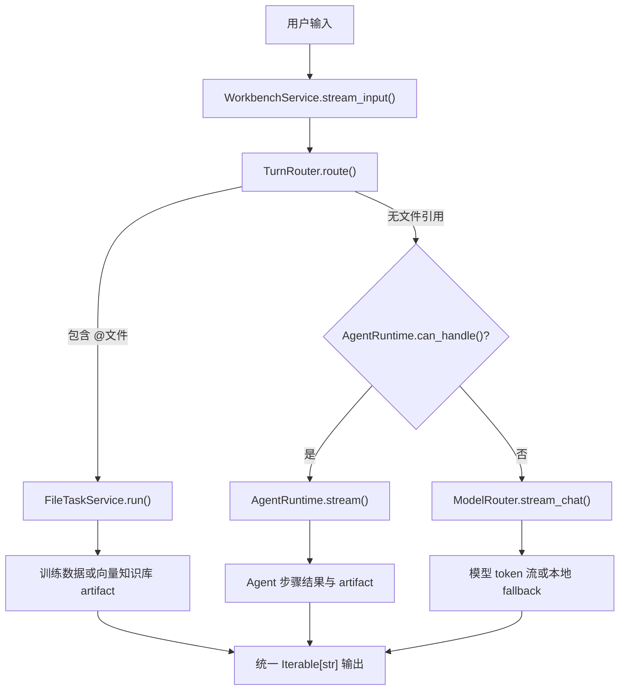
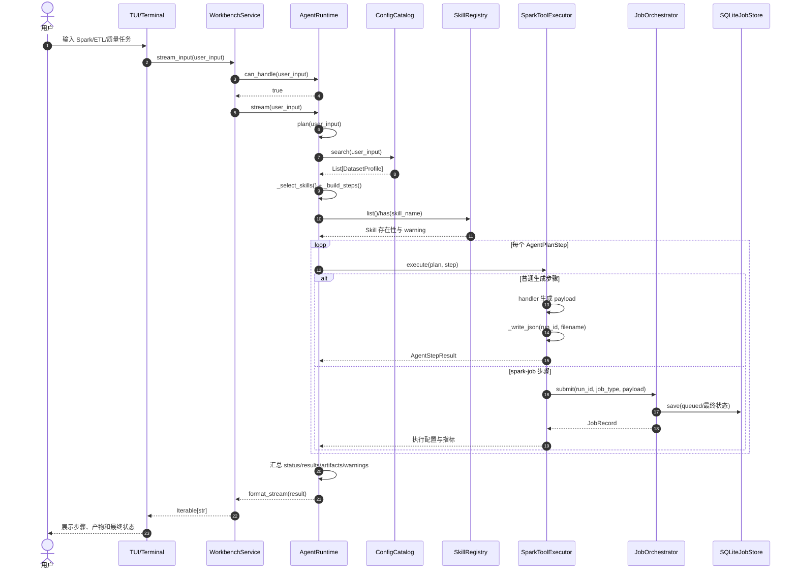
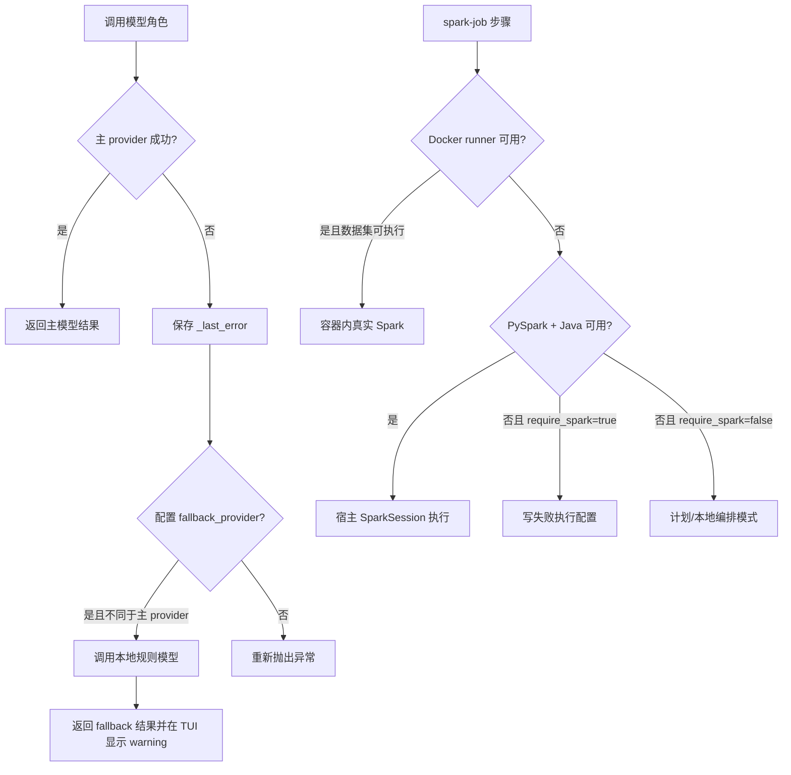

# 自然语言到 Spark Job 的端到端执行链路

- 原始链接: https://www.yuque.com/yuqueyonghu-ng3vtk/agi-saber/iwa0xtwahko8ripf
- Slug: iwa0xtwahko8ripf
- Doc ID: 275535322
- 层级: 3
- 字数: 2118
- 创建时间: 2026-06-28T11:50:01.000Z
- 更新时间: 2026-07-20T08:23:49.000Z
- 发布时间: 2026-07-20T08:23:48.000Z
- 内容更新时间: 2026-07-20T08:23:48.000Z
- 本地同步时间: 2026-10-08T16:25:13+08:00

## 标题结构

- h2: 1. 要解决的问题
- h2: 2. 核心对象与职责
- h2: 3. 输入路由架构
- h2: 4. Agent 完整执行链路
- h2: 5. 关键实现细节
- h3: 5.1 WorkbenchService.stream_input() 是统一边界
- h3: 5.2 TurnRouter 的文件引用解析
- h3: 5.3 Agent 意图与计划
- h3: 5.4 白名单执行
- h3: 5.5 步骤失败采用短路语义
- h2: 6. 模型与执行环境降级
- h2: 7. Artifact 设计
- h2: 8. 实现难点与取舍
- h3: 不确定语义与确定执行之间的边界
- h3: “生成”与“执行”的状态区分
- h3: 长链路部分成功
- h3: 安全边界仍不完整
- h2: 9. 源码索引与验证
- h2: 10. 如何向面试官概括

## 资源链接


## 正文

<a id="Kq9Ol"></a>
## 1. 要解决的问题


自然语言输入是不确定的，Spark 作业执行却要求确定的表、字段、资源、状态和失败语义。系统不能把模型生成的任意代码直接执行，也不能把“生成了 SQL”包装成“作业已经成功”。这一链路的目标是把不确定输入逐步收敛成结构化计划、白名单工具调用和可审计产物。


主要约束包括：


- 普通聊天、文件处理和数据工程长任务必须隔离，避免错误路由。

- Agent 只能调用系统注册的工具，不能根据字符串动态导入或执行任意函数。

- 数据表和字段尽量来自 Catalog，而不是完全依赖模型记忆。

- 主模型、Spark 或 Docker 不可用时，必须暴露降级或失败状态。

- 每个运行使用稳定的 `run_id` 串联计划、步骤结果和 artifact。


<a id="c2sEu"></a>
## 2. 核心对象与职责


| 对象 | 所在层 | 职责 |
| --- | --- | --- |
| `SparkOsApp` / terminal chat | Interface | 获取输入、展示流式输出，不承载规划逻辑 |
| `WorkbenchService` | Application | 统一入口，编排三类输入路径 |
| `TurnRouter` | Application | 提取 `@文件`并识别文件任务类型 |
| `ModelRouter` | Infrastructure | 按角色调用模型并处理 fallback |
| `AgentRuntime` | Application | 判断 Agent 意图、生成步骤并顺序执行 |
| `ConfigCatalog` | Infrastructure | 提供真实数据集、路径、格式和字段语义 |
| `SkillRegistry` | Application | 加载外置 Skill 描述并检查是否存在 |
| `SparkToolExecutor` | Application | 将白名单 tool name 映射到可信 handler |
| `AgentPlan` | Domain | 保存用户目标、数据集、步骤、假设和 warning |
| `AgentRunResult` | Domain | 保存状态、已完成步骤、artifact 和 warning |


<a id="rCcUz"></a>
## 3. 输入路由架构





路由优先级很重要：`@文件`任务先于 Agent 关键词判断。否则“构建向量知识库 @doc.md”可能因为出现“数据”或“向量”被数据工程 Agent 提前截获。


<a id="Ih6hD"></a>
## 4. Agent 完整执行链路





<a id="s2e3S"></a>
## 5. 关键实现细节


<a id="d1KSM"></a>
### 5.1 `WorkbenchService.stream_input()` 是统一边界


它不关心 Textual 或普通终端，只返回 `Iterable[str]`。因此 UI 可以替换成 HTTP SSE，而不需要把 Agent 路由重新实现一遍。三条路径最终统一成字符串迭代器，但内部语义不同：模型聊天可能是真 token 流，文件任务是完成后切块，Agent 当前是执行完成后格式化。


<a id="A6qav"></a>
### 5.2 `TurnRouter` 的文件引用解析


正则 `_FILE_PATTERN` 支持无引号、单引号和双引号路径。相对路径以 workspace root 解析，并把 `raw/path/exists` 保存到 `FileReference`。任务类型按训练数据关键词和向量关键词识别，无法识别时返回 `TaskType.UNKNOWN`，由服务提示用户补充上下文。


<a id="D6bsU"></a>
### 5.3 Agent 意图与计划


`AgentRuntime.can_handle()` 当前基于 `_AGENT_INTENT_KEYWORDS`。`plan()` 的顺序是：


1. `_select_skills()` 根据请求关键词生成 Skill 名称。

2. `CatalogPort.search()` 查找相关数据集。

3. `_build_steps()` 为每个 Skill 创建 `AgentPlanStep`。

4. `_skill_warnings()` 检查外置 Skill 是否加载。

5. 生成 `AgentPlan`，包含假设、warning 和结构化步骤。


这条路径是确定性规则规划，不是 LLM 自主工具选择。它的优势是稳定、可复现；缺点是语义泛化有限。


<a id="S3YhH"></a>
### 5.4 白名单执行


`SparkToolExecutor.execute()` 内部维护固定字典：


```python
handlers = {
    "spark_sql": self._spark_sql,
    "etl_pipeline": self._etl_pipeline,
    "data_cleaning": self._data_cleaning,
    "data_quality": self._data_quality,
    "feature_engineering": self._feature_engineering,
    "spark_job": self._spark_job,
    "dag_diagnosis": self._dag_diagnosis,
    "graph_compute": self._graph_compute,
}
```


未知工具直接抛出 `ValueError`。这比 `getattr()` 或动态 import 更安全，也便于代码审查和单元测试。


<a id="ektcG"></a>
### 5.5 步骤失败采用短路语义


`AgentRuntime.run()` 逐步执行。任一步抛出异常时：


- 保留此前已完成的 `results`；

- 收集已生成的 artifact；

- 添加包含 Skill、异常类型和信息的 warning；

- 返回 `AgentRunStatus.FAILED`，不继续执行依赖步骤。


这相当于简单的 fail-fast 工作流。当前没有补偿事务或步骤级重试。


<a id="FSaZI"></a>
## 6. 模型与执行环境降级





模型 fallback 和 Spark fallback 是两类不同问题：前者处理认知服务不可用，后者处理计算运行时不可用。两者都必须显式暴露，不应静默把执行语义改变掉。


<a id="BFbja"></a>
## 7. Artifact 设计


每次运行以 `artifacts/agent-runs/<run-id>/` 为根目录，按阶段编号写入 JSON：


| 阶段 | 文件 |
| --- | --- |
| 查询 | `01_distributed_query.json` |
| ETL | `02_etl_pipeline.json` |
| 清洗 | `03_data_cleaning.json` |
| 质量 | `04_data_quality.json` |
| 特征 | `05_feature_engineering.json` |
| 执行 | `06_execution_config.json` |
| 诊断 | `07_dag_diagnosis.json` |
| 图计算 | `08_graph_result.json` |


编号不是调度依据，而是便于人工浏览。真正关联依赖的是 `run_id` 和 `AgentPlanStep.depends_on`。


<a id="y258k"></a>
## 8. 实现难点与取舍


<a id="wTp6T"></a>
### 不确定语义与确定执行之间的边界


完全由规则选择 Skill 稳定但泛化弱；完全交给 LLM 灵活但不可控。合理演进是让模型生成受 JSON Schema 约束的候选计划，再由 Catalog、权限、成本和依赖校验器审核。


<a id="j9aH6"></a>
### “生成”与“执行”的状态区分


SQL、质量规则或执行配置生成成功，不等于 Spark 成功。代码通过 `spark_available`、execution mode、Job status 和 metrics 区分这些状态，这是避免 Agent 假成功的关键。


<a id="J7bUH"></a>
### 长链路部分成功


当前失败时保留已完成 artifact，但不能从断点恢复。生产化需要持久化 step status、输入摘要、输出版本、幂等键和依赖图，以便重启后从最后成功节点继续。


<a id="ELYCg"></a>
### 安全边界仍不完整


白名单工具阻止任意函数执行，但 SQL 仍需 AST 解析、只读权限、表字段白名单、分区扫描门槛、资源预算和超时取消。


<a id="AR4C9"></a>
## 9. 源码索引与验证


- `sparkos/application/workbench.py`：统一输入边界。

- `sparkos/application/turn_router.py`：`@文件`路由。

- `sparkos/application/agent_runtime.py`：规则规划与 fail-fast 执行。

- `sparkos/application/spark_tools.py`：白名单 handler 与 artifact。

- `sparkos/infrastructure/llm/model_router.py`：模型角色和 fallback。

- `sparkos/cli.py`：组件装配。

- `tests/test_workbench.py`：聊天、文件、Agent、图任务和 artifact 测试。


<a id="YJqRp"></a>
## 10. 如何向面试官概括


> 我没有让 LLM 直接生成并执行代码，而是把自然语言任务收敛成结构化计划和白名单工具调用。系统区分聊天、文件和数据工程任务，通过 Catalog 限制表字段，通过 run_id 和 artifact 保留执行证据，并对模型与 Spark 运行时分别设计显式降级。当前规划主要是确定性规则，下一步才是受 Schema 约束的 LLM Planner。
