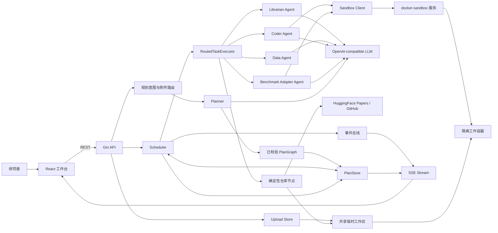
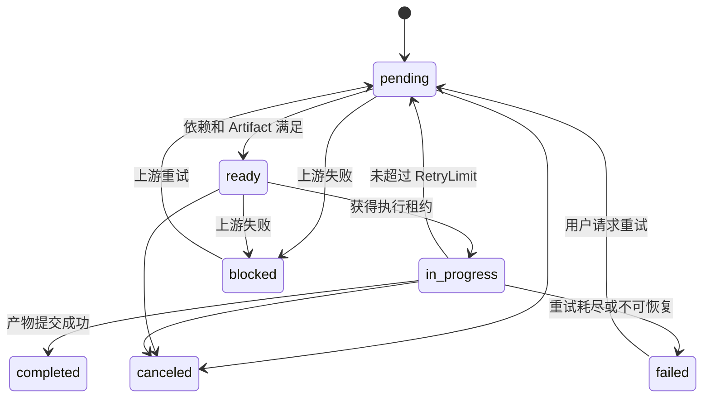
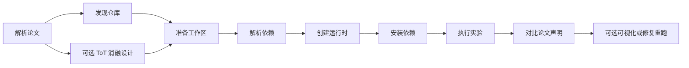

# AGI- researcher

- 原始链接: https://www.yuque.com/yuqueyonghu-ng3vtk/agi-saber/sezywfkbx8yglkq0
- Slug: sezywfkbx8yglkq0
- Doc ID: 278349726
- 层级: 1
- 字数: 3759
- 创建时间: 2026-07-20T16:51:49.000Z
- 更新时间: 2026-07-22T08:46:24.000Z
- 发布时间: 2026-07-21T16:00:57.000Z
- 内容更新时间: 2026-07-21T16:00:57.000Z
- 本地同步时间: 2026-10-08T16:25:13+08:00

## 标题结构

- h2: 1. 架构目标
- h2: 2. 系统总览
- h2: ​
- h2: 3. 仓库结构
- h2: 4. 前端架构
- h2: 5. Backend 分层
- h3: 5.1 API 层
- h3: 5.2 Planner
- h3: 5.3 Scheduler
- h3: 5.4 Routed Task Executor
- h2: 6. 核心数据模型
- h2: 7. Agent 与推理模式
- h3: 7.1 ToT 的位置
- h3: 7.2 ReAct 的位置
- h2: 8. 论文复现流程
- h2: 9. 自有数据 Benchmark 流程
- h2: 10. 文件上传与数据流
- h2: 11. 状态、事件与持久化
- h2: 12. Sandbox 执行面

## 资源链接

- [语雀原图](https://cdn.nlark.com/yuque/0/2026/png/54163865/1784649288451-98b0fe69-42f7-44d0-94f3-ad51785c634d.png?x-oss-process=image%2Fwatermark%2Ctype_d3F5LW1pY3JvaGVp%2Csize_52%2Ctext_5rC45rO954mb6YC8IHZ4K3d5emNhYw%3D%3D%2Ccolor_FFFFFF%2Cshadow_50%2Ct_80%2Cg_se%2Cx_10%2Cy_10)
- [语雀原图](../../ArchitectureDiagram.png?x-oss-process=image%2Fwatermark%2Ctype_d3F5LW1pY3JvaGVp%2Csize_9%2Ctext_5rC45rO954mb6YC8IHZ4K3d5emNhYw%3D%3D%2Ccolor_FFFFFF%2Cshadow_50%2Ct_80%2Cg_se%2Cx_10%2Cy_10)
- [ScholarApp.tsx](../frontend/src/app/ScholarApp.tsx)
- [routes.go](../backend/internal/api/routes.go)
- [plan_runtime.go](../backend/internal/api/plan_runtime.go)
- [planner.go](../backend/internal/planner/planner.go)
- [internal/Intent](../backend/internal/Intent/)
- [buildRuleIntentContext](../backend/internal/api/plan_runtime.go)
- [scheduler.go](../backend/internal/scheduler/scheduler.go)
- [executor.go](../backend/internal/scheduler/executor.go)
- [backend/internal/models](../backend/internal/models/)
- [mermaid](https://cdn.nlark.com/yuque/__mermaid_v3/49358fa3bf1de9a66e3f982647371920.svg)
- [ablation_tot.go](../backend/internal/agent/ablation_tot.go)
- [custom_benchmark_adapter_agent.md](custom_benchmark_adapter_agent.md)
- [uploads.go](../backend/internal/api/uploads.go)
- [SandboxClient](../backend/internal/sandbox/opensandbox.go)

## 正文


<a id="Z7PhZ"></a>
## 1. 架构目标


ScholarAgent 是一个面向科研任务的单机多 Agent 执行系统。它把用户目标转换为带依赖和产物契约的 DAG，在受限容器中执行代码，并把节点状态、日志、指标和报告实时返回前端。


当前架构遵循四个原则：


1. **控制面和执行面分离**：Backend 负责任务规划、状态和调度，Docker Sandbox 负责不可信代码执行。

2. **Artifact 驱动协作**：Agent 不共享隐式内存，下游通过命名 Artifact 接收上游结果。

3. **模型负责建议，代码负责约束**：LLM 可以规划、生成和修复；DAG 校验、预算、哈希、指标重算和沙箱策略由确定性代码执行。

4. **自动化必须有边界**：ToT、ReAct、重试、并发、运行时长和样本数都有明确上限。


> 原文图片未能加载（语雀原文资源状态）；请查看原始页面。资源标识：`../../ArchitectureDiagram.png?x-oss-process=image%2Fwatermark%2Ctype_d3F5LW1pY3JvaGVp%2Csize_9%2Ctext_5rC45rO954mb6YC8IHZ4K3d5emNhYw%3D%3D%2Ccolor_FFFFFF%2Cshadow_50%2Ct_80%2Cg_se%2Cx_10%2Cy_10`


<a id="P58jp"></a>
## 2. 系统总览


<a id="C8MMM"></a>
## 





系统分成三个主要运行单元：


| 运行单元 | 默认端口 | 主要职责 |
| --- | --- | --- |
| `frontend` | `5173` | 对话、上传、PDF 阅读、DAG 展示、执行控制和结果查看 |
| `backend` | `8080` | API、意图路由、Planner、Scheduler、Agent、PlanStore、SSE |
| `docker-sandbox` | `8082`，Compose 仅绑定本机 | 创建容器、执行 Python/命令、流式回传 stdout/stderr、清理容器 |


`ai-services/intent_recognition` 是可选 Python 原型服务。它不在默认 Compose 中启动，也没有接入当前 Backend 的生产请求链。


<a id="Jogl9"></a>
## 3. 仓库结构


```latex
scholar-agent/
├── frontend/                   # React + TypeScript 工作台
├── backend/
│   ├── cmd/api/                # 独立 Backend 入口
│   ├── cmd/app/                # 内嵌前端和本地沙箱的单文件入口
│   ├── internal/api/           # HTTP、身份、上传、SSE
│   ├── internal/planner/       # LLM Planner、模板兜底、DAG 校验
│   ├── internal/scheduler/     # 调度、租约、仓库发现与工作区准备
│   ├── internal/agent/         # 专业 Agent、ToT、ReAct、Benchmark Harness
│   ├── internal/models/        # PlanGraph、Task、Artifact、Event 契约
│   ├── internal/store/         # 内存和文件 PlanStore
│   ├── internal/events/        # 计划级内存事件总线
│   └── internal/sandbox/       # Sandbox HTTP 客户端
├── docker-sandbox/             # 独立 Go 沙箱服务和 Docker 引擎
├── ai-services/                # 可选 Python AI 服务
├── examples/                   # 可运行示例和验收脚本
├── docs/                       # 架构、功能和实验文档
├── scripts/                    # Unix / Windows 启动脚本
├── docker-compose.yml
└── Makefile
```


根目录的 `docker-core/` 是早期或底层 Docker 相关代码与配置。当前默认网站服务的沙箱入口是 `scholar-agent/docker-sandbox/`。


<a id="zRy8l"></a>
## 4. 前端架构


前端入口是 `[ScholarApp.tsx](../frontend/src/app/ScholarApp.tsx)`，主要由以下部分组成：


| 模块 | 职责 |
| --- | --- |
| `useScholarChatFlow` | 会话、消息、附件上传、创建计划、浏览器本地持久化 |
| `useScholarRuntime` | 启动/审批/取消计划，订阅 SSE，维护节点日志和结果状态 |
| `buildGraphLayout` | 把 Backend 的 `PlanGraph` 转换为 React Flow 节点和边 |
| `GraphPanel` | DAG 画布、缩放、节点选择和状态展示 |
| `ExecutionSidebar` | 日志、报告、代码、指标和图片视图 |
| `PdfPanel` / `usePdfAssistFlow` | PDF 阅读、划词与辅助问答 |
| `scholarApi` | REST、SSE 和上传协议封装 |


前端会话保存在浏览器 `localStorage`。它用于恢复界面，不是服务端账户系统。计划和执行状态仍以后端 `PlanStore` 为准。


前端有两条执行路径：


- **计划执行**：创建完整 DAG，调用 `/api/plans/:id/execute`，再通过 `/api/plans/:id/stream` 订阅事件。这是正式主链。

- **单节点执行**：调用 `/api/execute` 直接运行一个 Agent。它适合调试和手动运行，不具备完整计划的持久化、审批、租约和依赖治理。


<a id="XQWag"></a>
## 5. Backend 分层


<a id="TAdgv"></a>
### 5.1 API 层


`[routes.go](../backend/internal/api/routes.go)` 和 `[plan_runtime.go](../backend/internal/api/plan_runtime.go)` 提供以下边界：


- 对话与单节点执行

- 文件上传和读取

- 计划创建、查询、审批、执行、取消

- 失败节点重试和 Agent 重分配

- 事件历史与计划级 SSE

- PDF 代理和服务健康检查


所有 `/api` 请求都经过可选静态 Bearer Token 中间件。计划和上传还会检查 `X-User-Id` 或匿名 Cookie 对应的所有者。


<a id="uZeY7"></a>
### 5.2 Planner


`[planner.go](../backend/internal/planner/planner.go)` 输出 `PlanGraph`。规划顺序如下：


1. API 用规则提取任务类型、仓库 URL、论文信息、复现模式和附件。

2. 自有数据 Benchmark 始终生成固定的 11 节点 DAG。

3. 其他任务在配置 LLM 后优先调用 Planner Agent。

4. 模型输出会经过任务类型归一化、Agent 白名单、Artifact 契约和 DAG 校验。

5. 模型不可用或输出不合法时，回退到确定性模板。


当前主要意图类型：


| Intent type | 典型流程 |
| --- | --- |
| `Paper_Reproduction` | 论文解析、仓库发现、环境准备、执行和论文声明对比 |
| `Framework_Evaluation` | 共同协议、并行框架实现、独立运行和比较报告 |
| `Code_Execution` | 代码生成、依赖、运行和结果验证 |
| `Custom_Benchmark` | 用户数据分析、仓库适配、预检、正式评测和证据校验 |
| `General` | 通用研究或处理节点 |


`[internal/Intent](../backend/internal/Intent/)` 和 Python 意图服务目前不是这条生产路径的一部分。当前 API 使用 `[buildRuleIntentContext](../backend/internal/api/plan_runtime.go)`，Planner Agent 负责后续拓扑生成。


<a id="k5QRU"></a>
### 5.3 Scheduler


`[scheduler.go](../backend/internal/scheduler/scheduler.go)` 是 DAG 状态机。它只把同时满足以下条件的节点提升为 `ready`：


- 所有依赖节点已完成。

- 所有 `required_artifacts` 已存在。


当前 API 创建的 Scheduler 最大并发数为 2。若 Ready 集合中存在非并行节点，会优先只执行一个串行节点；否则按优先级和创建时间选择并行节点。


Scheduler 负责：


- 任务超时、节点重试和计划总预算

- 失败传播与下游 `blocked`

- 取消、人工重试和 Agent 重分配

- `execution_id`、`lease_owner`、`execution_epoch` 执行租约

- 丢弃重分配或取消后返回的迟到结果

- 将日志、状态和 Artifact 同时写入事件历史并发布到事件总线


默认计划预算是 100 次任务尝试和 2100 秒。部署可通过 `PLAN_MAX_TASK_ATTEMPTS` 与 `PLAN_MAX_DURATION_SECONDS` 收紧。


<a id="ihIWi"></a>
### 5.4 Routed Task Executor


`[executor.go](../backend/internal/scheduler/executor.go)` 把 `TaskNode` 转换为 Agent 可执行的 `Task`，合并节点输入和上游 Artifact，再按 `assigned_to` 路由。


有两个容易混淆的边界：


- `sandbox_agent` 是逻辑角色，目前由 `CoderAgent` 中的运行时准备、依赖安装和代码执行方法处理，并不是独立的 Agent 结构体。

- `repo_discovery` 和 `repo_prepare` 是确定性 Backend 节点，直接由 Scheduler 层实现，不经过 LLM Agent 路由。


<a id="eHHn3"></a>
## 6. 核心数据模型


核心契约位于 `[backend/internal/models](../backend/internal/models/)`：


| 模型 | 作用 |
| --- | --- |
| `PlanGraph` | 一次可执行计划，包含所有者、预算、审批、节点、边、Artifact 和统计 |
| `TaskNode` | DAG 节点，包含依赖、输入输出契约、Agent、优先级、重试和租约 |
| `TaskContract` | 版本化的输入 Artifact、输出 Artifact 和允许工具边界 |
| `Artifact` | 节点间传递的命名结果，记录类型、生产者、值和元数据 |
| `PlanEvent` | 状态、日志、Artifact 和终态事件，带 `trace_id` 与任务 span |





Artifact 同时承担数据接口和可追踪证据的作用。例如 `repo_url`、`dependency_spec`、`prepared_runtime`、`run_metrics` 和 `evaluation_report` 都是显式契约，不靠 Agent 猜测上一步输出。


<a id="Cl5Gr"></a>
## 7. Agent 与推理模式


| Agent | 当前实现 |
| --- | --- |
| `ChatAgent` | 通用问答；代码型问题可委托 Coder |
| `LibrarianAgent` | 论文解析、资料归纳和方法声明提取 |
| `CoderAgent` | 代码生成、依赖解析、运行时准备、安装、执行与修复 |
| `DataAgent` | 指标分析、论文对比、报告和受限消融设计 |
| `BenchmarkAdapterAgent` | 数据契约分析、仓库入口适配、预检修复、正式评测与证据校验 |


Librarian、Coder、Data 和 Chat 使用 Eino 编排 OpenAI-compatible Chat Model。模型地址、模型名和密钥通过环境变量或配置文件提供。


<a id="j3iCR"></a>
### 7.1 ToT 的位置


ToT 只用于“轻量消融设计”，实现位于 `[ablation_tot.go](../backend/internal/agent/ablation_tot.go)`：


1. 模型扩展参数、模块、数据规模、随机种子和运行成本候选。

2. 模型评估信息增益、相关性、可复现性与风险。

3. Go 代码重新限幅、打分，并在实验数、GPU 时间和总时长预算内选择不同类别的候选。


搜索深度固定为 2，候选分支最多 8，默认最多选择 3 个实验。模型失败时使用确定性候选和评分，不会无限展开思维树。


<a id="ox9zM"></a>
### 7.2 ReAct 的位置


ReAct 用于局部故障修复，不用于全局拓扑搜索：


- 依赖安装最多尝试 3 次。模型根据 pip 错误选择删除、替换、重写依赖或升级 Python 镜像，规则再处理标准库误识别和 Python 版本不匹配。

- Benchmark Adapter 预检最多 3 次。每次只能替换受控适配器文件，正式评测阶段不再自动修改代码。

- 代码运行遇到缺失模块时允许一次最小补装并重跑。


这种划分保持了“全局方案选择有预算，局部修复有次数，正式结果不漂移”。


<a id="B9tvD"></a>
## 8. 论文复现流程


标准论文复现主链如下：





关键实现边界：


- 仓库发现优先使用用户指定 GitHub URL；否则查询 HuggingFace Papers API，并可使用 GitHub 搜索或内置候选兜底。

- 工作区准备会浅克隆仓库、扫描代码和依赖文件、复制上传材料，并输出 `repo_manifest`。

- 系统根据用户请求和本机 CPU、内存、磁盘、GPU 探测选择 `smoke` 或 `full`。

- `full` 模式或部署强制审批时，计划进入 `awaiting_approval`，未批准不能执行。

- `smoke` 是结构和执行链验证，不等同于完整数据训练或论文指标复现。


<a id="V32vR"></a>
## 9. 自有数据 Benchmark 流程


上传 CSV、TSV、JSON 或 JSONL 并要求对公开仓库做 Benchmark 时，系统生成固定流程：


```latex
数据分析 ------------------------------+
                                      |
仓库发现 -> 工作区准备 ----------------+-> 生成适配器
                                            -> 解析依赖
                                            -> 准备运行时
                                            -> 安装依赖
                                            -> 最多 8 条样本预检与修复
                                            -> 正式运行
                                            -> Go 端证据校验和指标重算
                                            -> 最终报告
```


Benchmark Harness 的信任边界不是“模型说成功”，而是：


- 上传文件、适配器和仓库源码均有哈希或指纹检查。

- 生成代码只能写入 `.scholar/benchmark/`，目标仓库源码不能被修改。

- 输出文件必须是普通文件，符号链接、超大文件和格式错误会被拒绝。

- 分类指标由 Go 重算 `accuracy` 和 `macro_f1`。

- 回归指标由 Go 重算 `mse` 和 `mae`。

- 上报指标与逐样本结果不一致时整次运行失败。


完整契约见 `[custom_benchmark_adapter_agent.md](custom_benchmark_adapter_agent.md)`。


<a id="vbA7L"></a>
## 10. 文件上传与数据流


上传实现在 `[uploads.go](../backend/internal/api/uploads.go)`：


1. 前端以 multipart 上传文件，单计划最多引用 8 个附件。

2. Backend 校验扩展名、检测 MIME、限制大小并计算 SHA-256。

3. 文件按用户 ID 哈希和上传 UUID 分目录保存，文件和元数据权限为 `0600`。

4. 创建计划时只允许当前所有者引用附件。

5. 仓库工作区节点把文件复制到 `.scholar/uploads/`，并拒绝不安全的符号链接路径。


默认最大单文件 32 MiB。Compose 使用独立 `scholar-upload-data` 卷。当前没有上传删除和自动过期机制，长期部署需要外部生命周期管理。


<a id="RuQw7"></a>
## 11. 状态、事件与持久化


`PlanStore` 有两种实现：


- 未设置 `PLAN_STORE_PATH`：仅使用内存，进程退出后计划消失。

- 设置 `PLAN_STORE_PATH`：使用单个 JSON 快照文件保存计划和事件，写入采用临时文件、`fsync` 和原子替换。


Compose 默认把快照写到 `/app/data/plans.json`，对应 `scholar-plan-data` 卷。


Backend 重启时会把中断的 `in_progress` 计划和节点恢复为 `pending` 并清除旧租约。恢复后不会自动重新启动执行，需要客户端再次调用执行接口。


事件同时写入 PlanStore 和内存 Event Bus。SSE 订阅先回放历史事件，再接收实时事件，并定期从持久化历史补漏。因此慢客户端即使错过内存广播，也能从事件历史恢复。


常用事件包括：


```latex
plan_started
task_ready
task_started
task_log
artifact_created
task_completed
task_retrying
task_failed
task_blocked
task_result_discarded
plan_completed / plan_failed / plan_canceled
```


<a id="X4uv9"></a>
## 12. Sandbox 执行面


Backend 通过 `[SandboxClient](../backend/internal/sandbox/opensandbox.go)` 调用独立沙箱服务。沙箱服务优先使用原生 Docker；只有显式设置 `ENABLE_OPENSANDBOX_FALLBACK=true` 时才会尝试 OpenSandbox。


默认 Docker 容器策略：


| 项目 | 默认值 |
| --- | --- |
| CPU | `2` |
| 内存 | `4g` |
| PID | `256` |
| Linux capabilities | `ALL` dropped |
| Privilege escalation | `no-new-privileges` |
| 网络 | `bridge` |
| 工作区挂载 | 仅允许 `SANDBOX_WORKSPACE_ROOTS` 下的真实目录 |
| GPU | 默认关闭；通过 `SANDBOX_DOCKER_GPUS` 显式请求 |


论文仓库工作区位于系统临时目录。Compose 把宿主机 `/tmp` 同时挂到 Backend 和 Sandbox 服务，使沙箱创建的工作容器可以挂载同一工作区。


`bridge` 只表示容器网络隔离，不表示离线。对不需要联网的实验，应设置 `SANDBOX_NETWORK_MODE=none`。镜像白名单、只读根文件系统和非 root 用户也需要通过对应环境变量显式开启。
