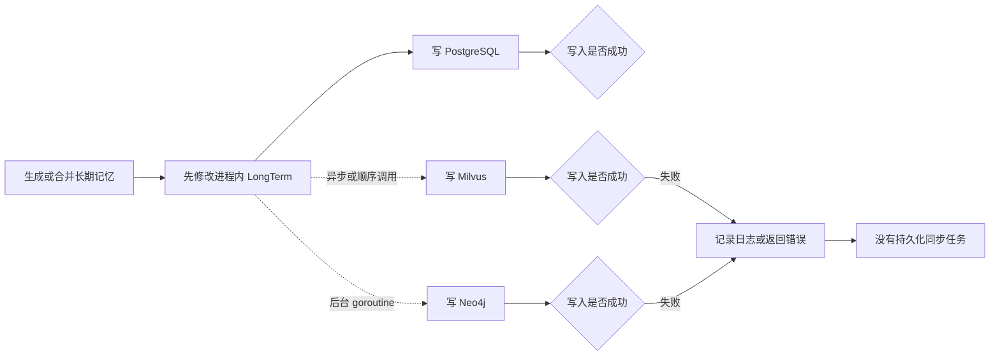
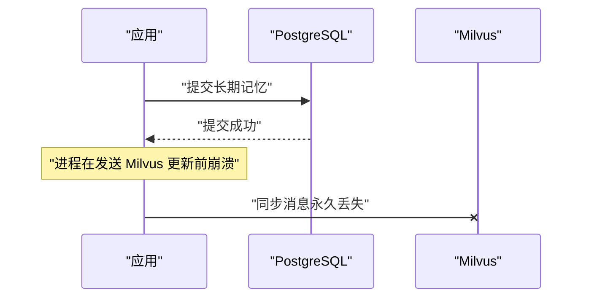
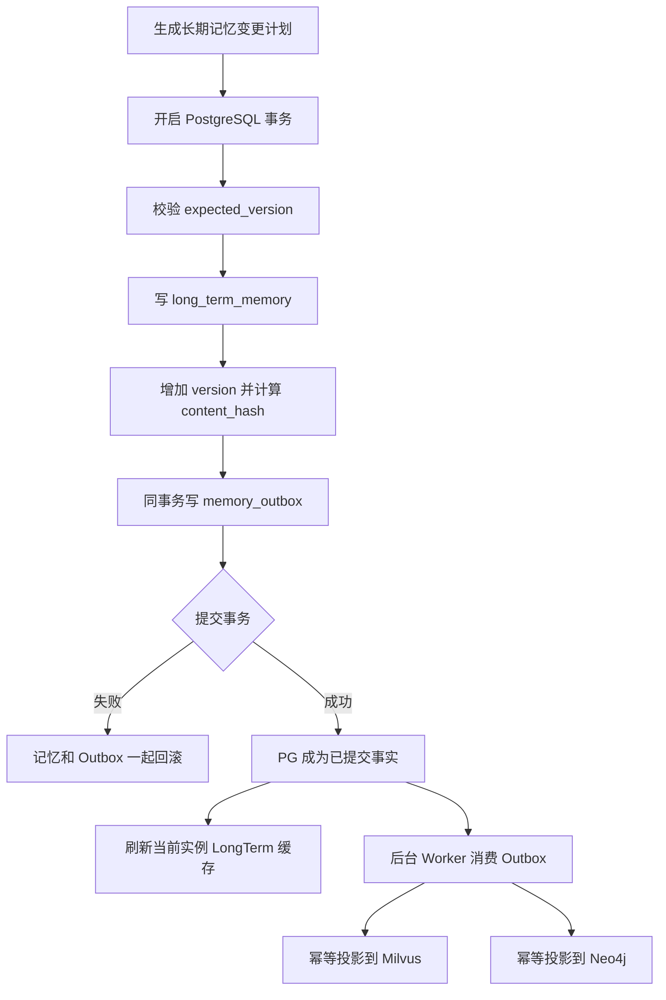
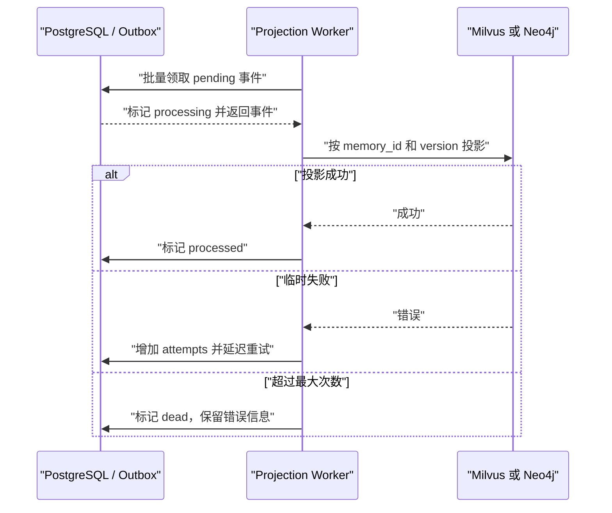
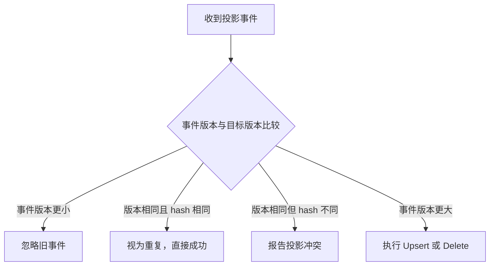
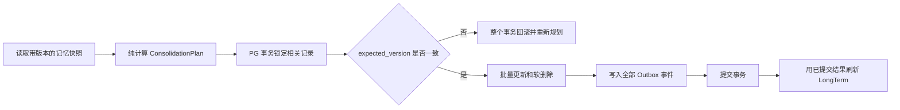
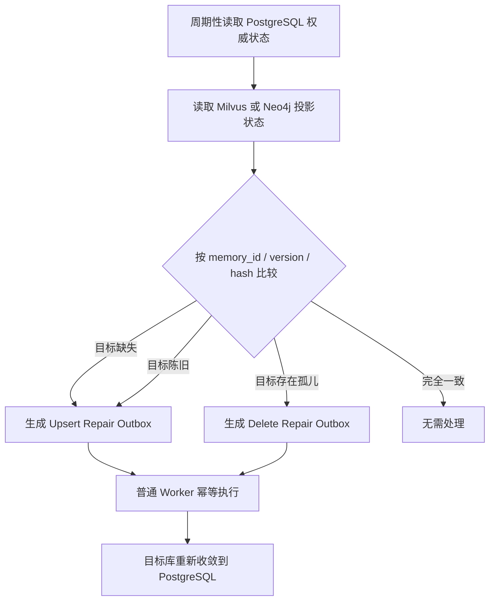

# 修改前后链路对比

- 原始链接: https://www.yuque.com/yuqueyonghu-ng3vtk/agi-saber/thopyd698ivumi0a
- Slug: thopyd698ivumi0a
- Doc ID: 279045591
- 层级: 4
- 字数: 2037
- 创建时间: 2026-07-26T09:57:17.000Z
- 更新时间: 2026-10-07T10:25:57.000Z
- 发布时间: 2026-07-26T10:03:20.000Z
- 内容更新时间: 2026-07-26T10:03:20.000Z
- 本地同步时间: 2026-10-08T16:25:13+08:00

## 标题结构

- h2: 一、修改前的链路
- h2: 二、修改后的写入链路
- h2: 三、修改后的异步投影链路
- h2: 四、修改后的合并链路
- h2: 五、修改后的自动对账链路
- h2: 六、为什么现在能保证最终一致性
- h3: 1. 权威状态唯一
- h3: 2. 已提交变化不会没有传播任务
- h3: 3. 进程崩溃不会丢失任务
- h3: 4. 重复和乱序不会破坏最终结果
- h3: 5. 临时故障可以恢复
- h3: 6. 永久漂移能够被发现和修复
- h2: 七、修改前后本质差异
- h2: 当前实现边界

## 资源链接

- [mermaid](https://cdn.nlark.com/yuque/__mermaid_v3/4868dffe72ed5c436a77f02a7bc55c01.svg)
- [mermaid](https://cdn.nlark.com/yuque/__mermaid_v3/a3421ea0d355ef982f177d8be47a81cf.svg)
- [mermaid](https://cdn.nlark.com/yuque/__mermaid_v3/6db3f1c2a66d8f562034bad6159ccabc.svg)
- [mermaid](https://cdn.nlark.com/yuque/__mermaid_v3/2f8ce40430e73336e37bfe423f11af9b.svg)
- [mermaid](https://cdn.nlark.com/yuque/__mermaid_v3/00b5f68d25b5a8a9a0c874f19aeede05.svg)
- [mermaid](https://cdn.nlark.com/yuque/__mermaid_v3/259ede182f0063defdcc94f7350b78cf.svg)
- [mermaid](https://cdn.nlark.com/yuque/__mermaid_v3/9bac3a2557e96f0eb32d13cfcd9d034d.svg)
- [mermaid](https://cdn.nlark.com/yuque/__mermaid_v3/f11b14e19ab0e7994c5dc03af2d76f82.svg)
- [长期记忆更改涉及多库怎么保持一致性](https://www.yuque.com/yuqueyonghu-ng3vtk/agi-saber/pg97d29hcvrzbrbk)

## 正文

整体变化可以概括为：从“业务代码分别修改多个存储”改成“PostgreSQL 先一次性记录事实和同步任务，其他存储只做可重建的异步投影”。


<a id="GtUPF"></a>
## 一、修改前的链路





旧链路的问题是，每个数据库都是一次独立的副作用：


1. 先改内存，再改 PostgreSQL如果 PostgreSQL 写入失败，进程内 LongTerm 可能已经是新状态；重启后又会恢复成 PostgreSQL 的旧状态。

2. PostgreSQL、Milvus、Neo4j 分别写入三个数据库不在同一个事务中，无法保证一起成功或一起失败。

3. 存在“提交成功但通知丢失”的窗口





PG 已经是新数据，但系统里没有持久化记录说明 Milvus 还需要更新。进程重启也不知道漏了什么。


4. 重试可能造成旧数据覆盖新数据如果版本 1 的事件比版本 2 更晚到达，旧事件可能把目标库重新写回版本 1。

5. 删除和合并尤其危险合并可能包含更新主记录、删除重复记录、更新 Milvus、删除 Neo4j 节点等多个步骤。中间任何一步失败，都会留下半完成状态。

6. 没有自动纠偏机制即使历史上已经产生缺失向量、孤儿图节点或陈旧数据，也没有后台机制发现并修复。


因此，原来的链路只能做到“多数情况下同步成功”，不能提供最终一致性保证。


---


<a id="YkCUQ"></a>
## 二、修改后的写入链路





现在一次业务变更包含两部分，而且位于同一个 PostgreSQL 事务中：


- `long_term_memory`：最终业务状态；

- `memory_outbox`：把该状态传播到 Milvus、Neo4j 所必须完成的持久化任务。


对应事件包括：


- `upsert_memory_vector`

- `delete_memory_vector`

- `upsert_memory_graph_node`

- `delete_memory_graph_node`

- `upsert_memory_graph_edges`

- `delete_memory_graph_edges`


事务只有两种结果：


| PostgreSQL 事务结果 | 长期记忆 | Outbox |
| --- | --- | --- |
| 提交成功 | 新状态存在 | 同步任务一定存在 |
| 提交失败 | 新状态不存在 | 同步任务也不存在 |


这消除了最关键的“双写间隙”。


---


<a id="Wwud7"></a>
## 三、修改后的异步投影链路





Milvus 和 Neo4j 使用独立 Worker，因此一个目标库故障不会阻塞另一个目标库。


Worker 采用至少一次消费语义：事件可能重复执行，但不会轻易丢失。目标端通过稳定的 `memory_id`、`version` 和 `content_hash` 实现幂等及防乱序：





因此即使出现：


```latex
version 2 先到
version 1 后到
```


版本 1 也不会把版本 2 覆盖掉。


---


<a id="iGudb"></a>
## 四、修改后的合并链路


以前是“先改变共享状态，再逐项执行数据库操作”；现在拆成了 `Plan → Apply → Refresh`。





这样可以避免合并计算期间记录被其他请求修改后，旧计划仍然覆盖新数据。


只要有一条记录的 `expected_version` 不一致，整个合并事务都会回滚，不会出现“更新了一半、删除了一半”。


---


<a id="d6kNM"></a>
## 五、修改后的自动对账链路


Outbox 解决的是正常写入过程中的可靠传播；Reconciliation 解决的是历史错误、人工改库、目标库损坏和极端漏同步。





Reconciler 不直接修改目标库，而是重新生成 repair outbox，继续复用正常链路的：


- 重试；

- 幂等；

- 版本控制；

- 限流；

- 状态记录；

- 错误审计。


---


<a id="rQkTm"></a>
## 六、为什么现在能保证最终一致性


关键不是让三个数据库同时提交，而是建立以下几个可验证的不变量。


<a id="lB3KZ"></a>
### 1. 权威状态唯一


PostgreSQL 的 `long_term_memory` 是唯一 Source of Truth。


Milvus、Neo4j 和进程内 LongTerm 都是派生视图。发生冲突时永远以 PostgreSQL 为准，因此系统不会出现“到底哪个库是正确的”这种不可判定状态。


<a id="A5cPS"></a>
### 2. 已提交变化不会没有传播任务


业务状态和 Outbox 在同一个 PostgreSQL 本地事务中提交：


所以不存在：


- PG 成功但同步任务没创建；

- 同步任务创建了但 PG 最终回滚。


这是本方案能够成立的核心。


<a id="tOLh1"></a>
### 3. 进程崩溃不会丢失任务


PG 提交后，即使应用马上崩溃，Outbox 仍然保存在数据库里。应用重启或其他实例的 Worker 可以继续处理。


原来存在于 goroutine 或调用栈里的同步意图会随着进程退出而消失；现在同步意图是持久化数据。


<a id="vfU2C"></a>
### 4. 重复和乱序不会破坏最终结果


Worker 允许重复投递，但目标端按照版本判断：


- 旧版本忽略；

- 相同版本重复执行视为成功；

- 新版本覆盖旧版本；

- 相同版本不同 hash 视为冲突，而不是静默覆盖。


因此至少一次投递不会转化成重复副作用，乱序也不会造成状态倒退。


<a id="vravU"></a>
### 5. 临时故障可以恢复


Milvus 或 Neo4j 暂时不可用时，任务进入延迟重试，不影响 PostgreSQL 的权威状态。


只要目标库最终恢复，Worker 就可以继续处理积压任务。


<a id="e9sbC"></a>
### 6. 永久漂移能够被发现和修复


即使某个极端缺陷绕过了正常 Outbox，Reconciliation 仍然会比较权威状态和派生状态，并重新生成修复任务。


因此系统不仅具有“可靠传播”，还具有“闭环纠偏”。


---


<a id="KY37x"></a>
## 七、修改前后本质差异


| 维度 | 修改前 | 修改后 |
| --- | --- | --- |
| 权威数据源 | 内存、PG、Milvus、Neo4j 边界模糊 | PostgreSQL 唯一权威 |
| 多库写入 | 多次独立调用 | PG 状态与 Outbox 同事务 |
| PG 提交后崩溃 | 同步意图可能永久丢失 | Outbox 保留，重启后继续 |
| 投递语义 | 尽力而为 | 至少一次 |
| 重复事件 | 可能重复产生副作用 | 幂等处理 |
| 乱序事件 | 旧数据可能覆盖新数据 | 单调版本阻止状态倒退 |
| 并发合并 | 可能覆盖并发修改 | `expected_version` 乐观锁 |
| 删除 | 多库物理删除容易半完成 | PG 墓碑加版本化删除事件 |
| 历史漂移 | 无法自动发现 | 周期 Reconciliation |
| 目标库故障 | 业务链路可能失败或漂移 | PG 正常提交，目标库稍后收敛 |


最终提供的不是“任意时刻三库完全一致”的强一致性，而是：


> 一旦 PostgreSQL 提交成功，相应传播任务就不会丢失；在 PostgreSQL、Milvus 和 Neo4j 最终可用且 Worker 持续运行的前提下，派生数据会收敛到 PostgreSQL 的权威版本。


<a id="tzsP6"></a>
## 当前实现边界


需要说明的是，架构闭环已经形成，但当前代码仍有几项生产级加固工作：


- Reconciler 当前一次只比较首批最多 500 条，还需要完整游标分页；

- Neo4j 对账目前以节点为主，关系边还需要独立的完整对账；

- `processing` 事件的过期租约需要自动回收，防止 Worker 在处理期间崩溃后事件长期卡住；

- `dead` 事件需要告警、人工重放或自动恢复策略；

- Worker 批大小、重试次数、对账周期目前应进一步配置化。


所以更准确的结论是：**本次修改已经解决了原来最核心的事务双写、可靠传播、幂等和版本防乱序问题；补齐上述运行保障后，才能把架构上的最终一致性保证完整兑现为生产级保证。**


完整设计见[长期记忆更改涉及多库怎么保持一致性](https://www.yuque.com/yuqueyonghu-ng3vtk/agi-saber/pg97d29hcvrzbrbk)。
