# Saga 模式与状态机的结合：本质、实践与两种形态

- 原始链接: https://www.yuque.com/yuqueyonghu-ng3vtk/agi-saber/dgavrc04z97mmgfd
- Slug: dgavrc04z97mmgfd
- Doc ID: 278349498
- 层级: 1
- 字数: 3291
- 创建时间: 2026-07-20T16:43:28.000Z
- 更新时间: 2026-07-28T23:50:43.000Z
- 发布时间: 2026-07-27T12:12:47.000Z
- 内容更新时间: 2026-07-27T12:12:47.000Z
- 本地同步时间: 2026-10-08T16:25:13+08:00

## 标题结构

- h2: 一、Saga 的本质
- h3: 1.1 从一个基本问题说起
- h3: 1.2 Saga 的核心定义
- h3: 1.3 Saga 的本质不是"事务"，而是"约定"
- h3: 1.4 Saga 的两种基本形态
- h2: 二、Saga 的实践变体
- h3: 2.1 按编排方式划分
- h3: 2.2 按补偿策略划分
- h3: 2.3 落地形态清单
- h2: 三、Saga 为什么需要状态机
- h3: 3.1 无状态机的 Saga 是脆弱的
- h3: 3.2 状态机的三个作用
- h3: 3.3 Saga + 状态机 = 可恢复的分布式流程
- h2: 四、形态一：正向状态机 + 前滚 Saga
- h3: 4.1 核心思路
- h3: 4.2 关键设计点
- h3: 4.3 前滚型的核心哲学
- h3: 4.4 适用场景
- h3: 4.5 缺点
- h2: 五、形态二：正逆状态机 + 补偿 Saga
- h3: 5.1 核心思路
- h3: 5.2 关键设计点
- h3: 5.3 回滚型的核心哲学
- h3: 5.4 适用场景
- h3: 5.5 缺点
- h2: 六、两种形态的深度对比
- h3: 6.1 状态机形态对比
- h3: 6.2 机制对比表
- h3: 6.3 选择决策树
- h3: 6.4 混合策略是常态
- h2: 七、Saga + 状态机 的工程实践清单
- h3: 7.1 状态机设计的通用原则
- h3: 7.2 幂等设计的通用手法
- h3: 7.3 补偿设计的注意事项
- h3: 7.4 兜底机制是必需品
- h2: 八、总结
- h3: 8.1 三个核心命题
- h3: 8.2 一句话选型
- h3: 8.3 工程铁律

## 资源链接

- [mermaid](https://cdn.nlark.com/yuque/__mermaid_v3/8a8fda42fca3473c958b9a1a947b32bd.svg)
- [mermaid](https://cdn.nlark.com/yuque/__mermaid_v3/6a75f63907b9bbf89f6ae1d3105034e8.svg)
- [mermaid](https://cdn.nlark.com/yuque/__mermaid_v3/e68ef146977240671d0a95e8ed54aeb2.svg)
- [mermaid](https://cdn.nlark.com/yuque/__mermaid_v3/6edae24c94bd92debee0ba1539f0cadb.svg)
- [mermaid](https://cdn.nlark.com/yuque/__mermaid_v3/e4d09c062c55eea32b9a4502fcd876d4.svg)
- [mermaid](https://cdn.nlark.com/yuque/__mermaid_v3/1ab13e16df751baf68ee9f011bb49336.svg)
- [mermaid](https://cdn.nlark.com/yuque/__mermaid_v3/0fb7f26726a19c56294c64386fa9ca7b.svg)
- [mermaid](https://cdn.nlark.com/yuque/__mermaid_v3/db51c18bd060c3f1b5a0773e91eede57.svg)
- [mermaid](https://cdn.nlark.com/yuque/__mermaid_v3/bb5180183fc5ee9ba83464a8c0395a27.svg)
- [mermaid](https://cdn.nlark.com/yuque/__mermaid_v3/2ce358e91a6f691c76029004d3d6d9e8.svg)
- [mermaid](https://cdn.nlark.com/yuque/__mermaid_v3/77963dc0b1bfb5178b42bf69582719c4.svg)
- [mermaid](https://cdn.nlark.com/yuque/__mermaid_v3/fdbac729fad67c76164ad44db0ae3b7e.svg)
- [mermaid](https://cdn.nlark.com/yuque/__mermaid_v3/ce05592c148f3340e54a59f09941d493.svg)
- [mermaid](https://cdn.nlark.com/yuque/__mermaid_v3/94251a35d81ae1a597ca3cb902a7b24c.svg)
- [mermaid](https://cdn.nlark.com/yuque/__mermaid_v3/444ef8a90e78f2c5c91b299c690d6cb1.svg)
- [mermaid](https://cdn.nlark.com/yuque/__mermaid_v3/d7bac9cea0ce25db04158cf4fa2186d2.svg)

## 正文

<a id="S8UrH"></a>
## 一、Saga 的本质


<a id="AaNKo"></a>
### 1.1 从一个基本问题说起


分布式场景下，一个业务动作往往需要**跨多个服务、多个资源**完成。例如：


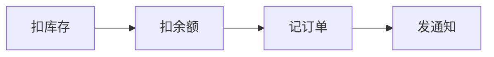


问题是：**没有一个全局事务能把这几步包起来一起提交或一起回滚**。任意一步失败，前面已经生效的动作都要"想办法撤销"。


Saga 就是为这类**长事务、跨资源、无法用 2PC** 的场景设计的模式。


<a id="ennr3"></a>
### 1.2 Saga 的核心定义


> **Saga 是一个由若干本地事务（T1, T2, ..., Tn）组成的序列，每个本地事务 Ti 都有一个对应的补偿事务 Ci。当 Sn 失败时，通过依次执行 Cn-1, Cn-2, ..., C1 来撤销已经完成的工作。**


用图表达：


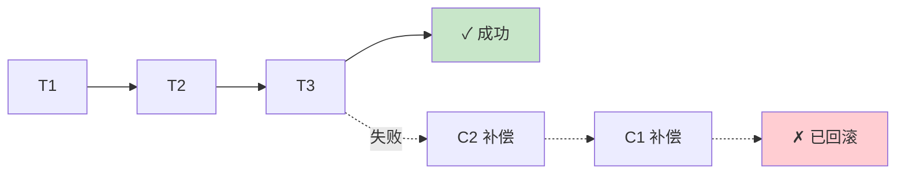


<a id="yPZyZ"></a>
### 1.3 Saga 的本质不是"事务"，而是"约定"


**关键洞察**：Saga 放弃了 ACID 中的 **A（原子性）** 和 **I（隔离性）**，换取的是：


1. **可用性**：不需要全局锁，各服务独立可扩展

2. **性能**：无需协调者、无阻塞等待

3. **松耦合**：服务之间只通过事件/命令交互


代价是：


- **中间态对外可见**（隔离性丢失）——需要业务能容忍"扣了库存但订单还没生成"这种可见状态

- **补偿必须由业务自己定义**——框架给不了通用回滚


**所以 Saga 的本质是一种"业务级契约"**：正操作 + 逆操作 + 一致性最终由业务逻辑保证。


<a id="mACqs"></a>
### 1.4 Saga 的两种基本形态


按**控制流走向**划分：


| 形态 | 特征 | 直觉 |
| --- | --- | --- |
| **前滚型（Forward Recovery）** | 只推进不回退，失败就重试直到成功 | "既然做了就做完" |
| **回滚型（Backward Recovery）** | 失败逆序补偿回到起点 | "做错了就撤销" |


这是本文后半部分的核心——**这两种形态与状态机结合时，会产生完全不同的架构**。


---


<a id="Tpqqb"></a>
## 二、Saga 的实践变体


<a id="cr9vx"></a>
### 2.1 按编排方式划分


**编排式（Orchestration）**：有一个中心协调者调度所有步骤。


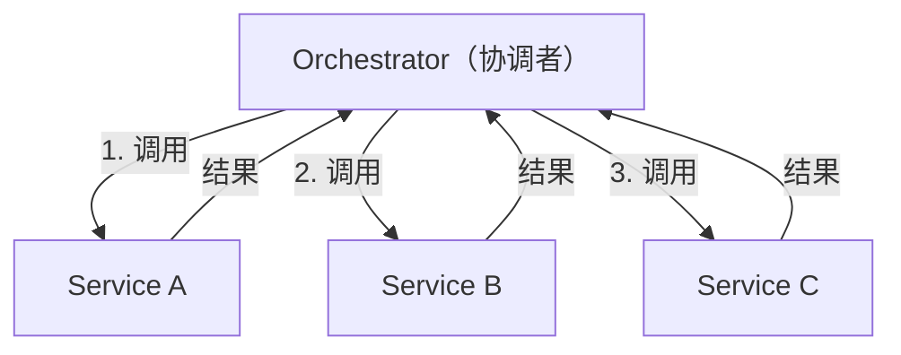


- **优点**：流程集中可见、易调试、状态好追踪

- **缺点**：协调者是逻辑瓶颈、单点故障风险

- **适合**：流程复杂、步骤依赖多


**协同式（Choreography）**：无中心，每个服务监听事件自己反应。


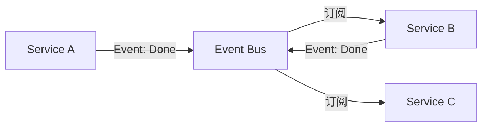


- **优点**：彻底解耦、无单点

- **缺点**：整体流程隐式、出问题难定位

- **适合**：微服务成熟度高、流程简单


<a id="NYXKo"></a>
### 2.2 按补偿策略划分


| 策略 | 语义 | 典型场景 |
| --- | --- | --- |
| **纯回滚（Backward）** | 失败逆序补偿到初始态 | 有明确反向动作的场景（如加库存反向扣库存） |
| **纯前滚（Forward）** | 失败继续重试直到成功 | 反向操作代价过大或不可能的场景 |
| **混合策略** | 前面步骤前滚、后面步骤回滚 | 大部分真实系统 |


<a id="Ws5R8"></a>
### 2.3 落地形态清单


Saga 在工程中常见的落地形态：


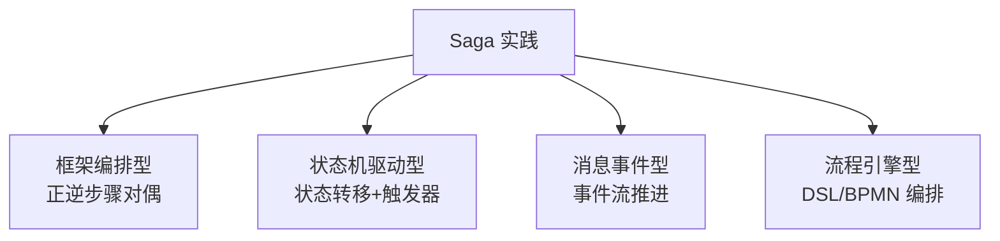


无论哪种形态，**核心都绕不开一件事：如何管理"我现在走到哪一步了"**——这就是状态机的用武之地。


---


<a id="ynhHU"></a>
## 三、Saga 为什么需要状态机


<a id="KKPIA"></a>
### 3.1 无状态机的 Saga 是脆弱的


考虑一个简单的 3 步 Saga：


```
T1 (扣库存) → T2 (扣余额) → T3 (生成订单)
```


如果 T2 之后系统宕机，重启后需要知道：


- 我是要**重放 T3**（前滚）还是**补偿 T1**（回滚）？

- 前面哪几步已经完成、哪几步还没做？

- 补偿到哪一步了？


**没有状态机 = 没有"记忆"**——每次崩溃后都要靠日志推理、靠人肉判断。


<a id="YmE27"></a>
### 3.2 状态机的三个作用


状态机在 Saga 中承担三个职责：


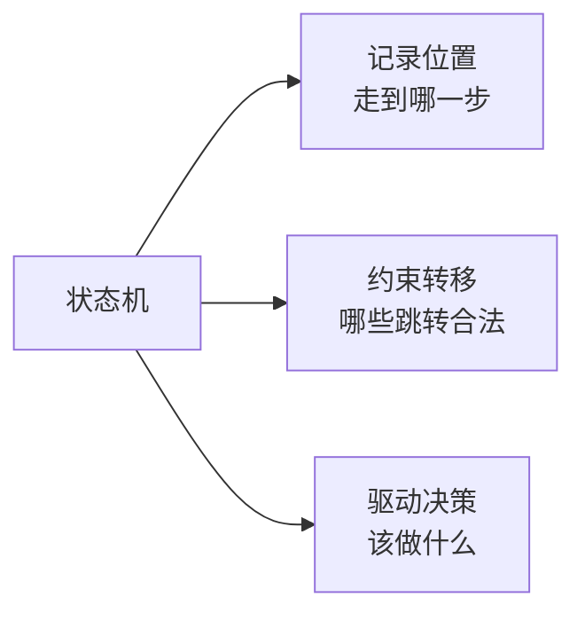


**① 记录位置**：把"当前进度"物化为一个可查询的状态字段
**② 约束转移**：非法的状态跳转被拒绝（比如"未 Init"不能直接进"Success"）
**③ 驱动决策**：宕机恢复时，看状态就知道下一步该做什么


<a id="ewC5U"></a>
### 3.3 Saga + 状态机 = 可恢复的分布式流程


真正的核心公式：


```
Saga（正逆步骤定义） + 状态机（持久化的位置）
    = 崩溃后可恢复的最终一致性流程
```


这就是所有生产级 Saga 实现的骨架。


---


<a id="HcRZl"></a>
## 四、形态一：正向状态机 + 前滚 Saga


<a id="vAOjJ"></a>
### 4.1 核心思路


**每个步骤成功都推进一次状态，失败就在当前状态不动、等待重试**。永不回退，只往前走。


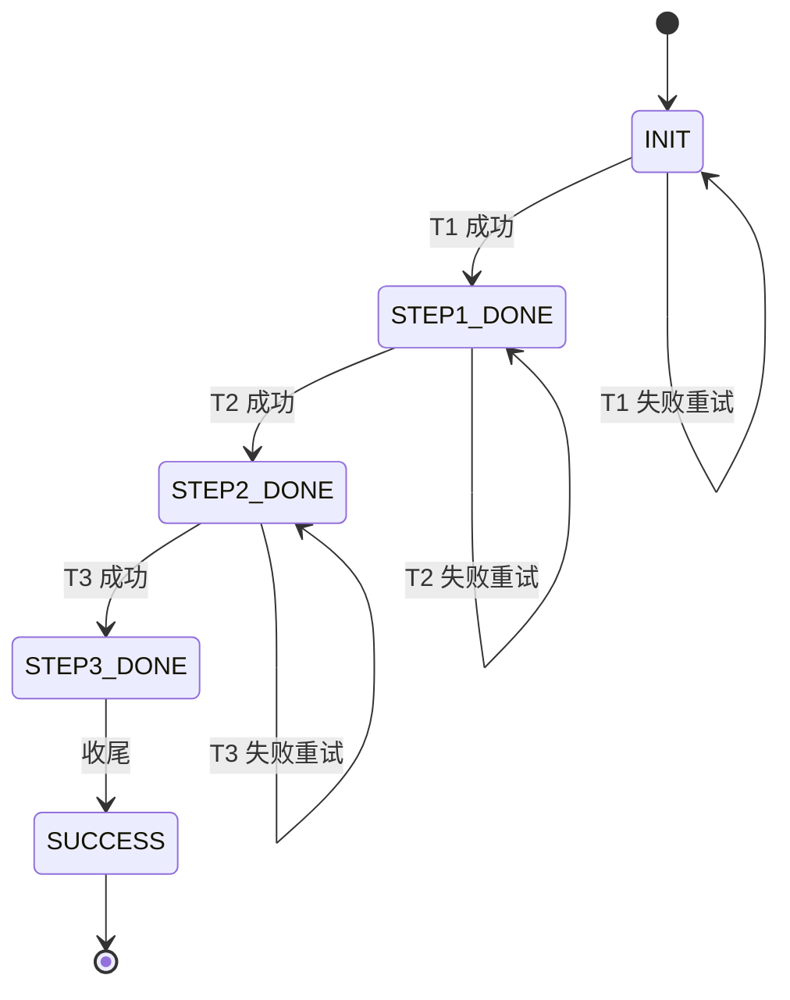


<a id="zIE5b"></a>
### 4.2 关键设计点


**① 状态即"完成度"**


状态字段直接对应"进度到哪一步"。宕机恢复只需要**从当前状态往后继续**。


**② 步骤幂等性是硬要求**


因为会重试，每个步骤必须做到**执行 N 次和执行 1 次结果相同**——通常靠幂等键 + 唯一索引。


**③ 状态转移的守卫**


每个步骤在执行前校验入口状态：


```
if (current_state != EXPECTED_LEFT_STATE) reject;
执行操作;
current_state = NEXT_STATE;
```


这层守卫防止"跳步执行"或"重复推进"。


**④ 失败态的处理**


失败不改状态，重试直到成功。若长时间失败：


**⑤ 对外语义："处理中" 而非 "失败"**


因为最终一定要成功，中间态对外表达为 `PROCESSING`——客户端**轮询而非重发**。


<a id="AbVIC"></a>
### 4.3 前滚型的核心哲学


> **"承诺发起 = 承诺完成"**


一旦流程 INIT 成功，就保证最终会走到 SUCCESS。系统不告诉调用方"失败了"，只告诉"还在处理中"。


<a id="pTq7P"></a>
### 4.4 适用场景


- **动作难以真正撤销**：如资金加减款、外部系统调用

- **业务上要求最终必达**：如支付回调、消息投递

- **补偿代价 > 重试代价**：如涉及对方服务的操作


<a id="ijpK6"></a>
### 4.5 缺点


- 需要**极强的幂等性设计**，任何非幂等操作都是雷

- 长时间卡在中间态时用户体验差

- `Compensate` 名存实亡——大部分补偿代码是空的


---


<a id="eYGka"></a>
## 五、形态二：正逆状态机 + 补偿 Saga


<a id="RYx8B"></a>
### 5.1 核心思路


**每个步骤都有正向和逆向两个动作。失败时按 LIFO 顺序执行逆向动作，把系统"擦干净"回到初始态**。


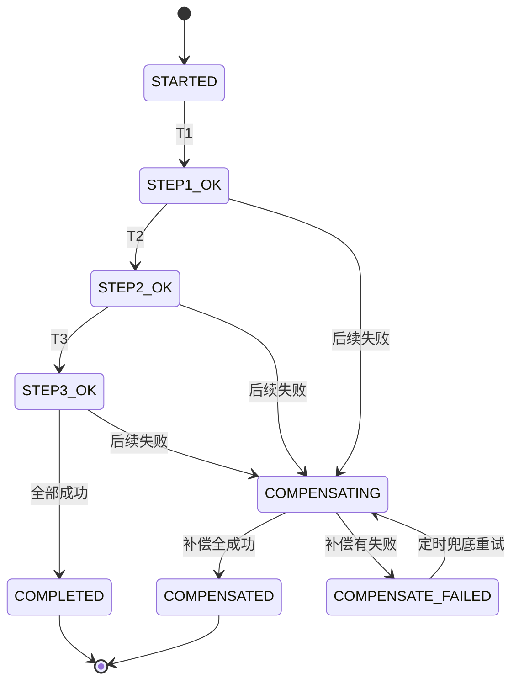


<a id="HzUFz"></a>
### 5.2 关键设计点


**① 步骤契约是"正逆对偶"**


每个步骤定义两个方法：


```
Step {
    Execute()    // 正向：扣库存
    Compensate() // 逆向：加回库存
}
```


**② 执行日志是补偿的依据**


必须记录"已经执行过哪些步骤"，才知道**要补偿哪些**：


```
StepLog:
  [{name: "T1", status: "executed"},
   {name: "T2", status: "executed"},
   {name: "T3", status: "failed"}]
```


补偿时倒序遍历 `executed` 的步骤，跳过 `failed`。


**③ 逆序补偿（LIFO）**


必须按**"后进先出"**顺序补偿——因为后面的步骤可能依赖前面步骤的结果：


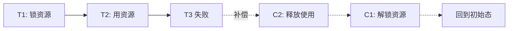


如果反过来先解锁再释放使用，会出现"资源已释放但仍被占用"的错乱。


**④ 补偿失败也要能重试**


补偿本身可能失败（网络、下游异常），所以：


- 补偿失败**不中断**，继续补偿其他步骤

- 全部结果记录，进入 `COMPENSATE_FAILED` 终态

- 定时 Job 扫描该终态，异步重试补偿


**⑤ 幂等性同样是硬要求**


- **Execute 幂等**：重放跳过已完成

- **Compensate 幂等**：重复补偿不能出错（比如"库存加两次"就完蛋了）


<a id="qbanB"></a>
### 5.3 回滚型的核心哲学


> **"要么全做，要么当没做"**


失败时通过补偿回到初始态，对外表达清晰的"成功 / 失败"二元结果，不留中间态。


<a id="kIHqn"></a>
### 5.4 适用场景


- **动作有明确反向操作**：加/减库存、创建/删除记录

- **业务能接受"失败"**：不追求最终必达

- **补偿代价 < 重试代价**：反向动作简单可靠


<a id="t47Xb"></a>
### 5.5 缺点


- 每个步骤都要设计补偿逻辑，**开发成本翻倍**

- 补偿本身失败会形成新的一致性问题

- 中间态期间的"脏数据"对其他事务可见（隔离性丢失）


---


<a id="O5cRG"></a>
## 六、两种形态的深度对比


<a id="tONGt"></a>
### 6.1 状态机形态对比


**正向型状态机**：单向推进


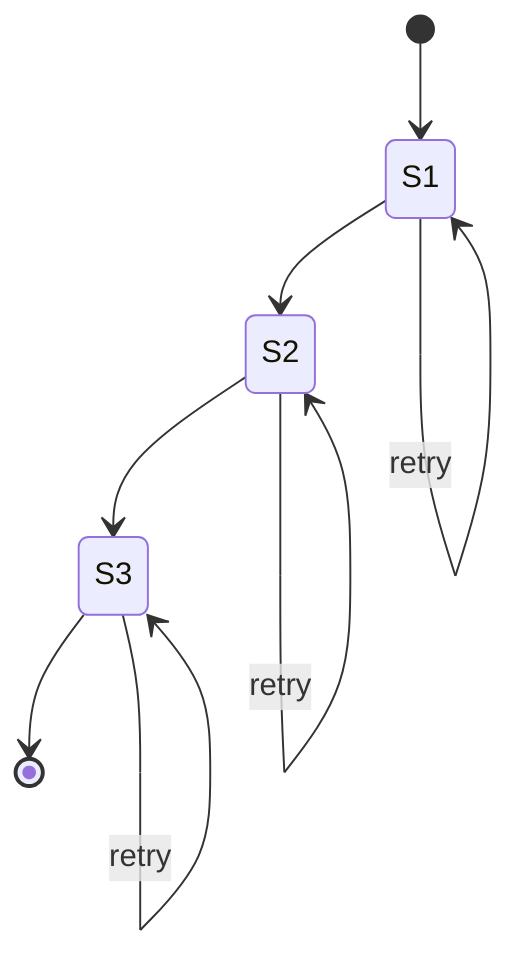


**正逆型状态机**：分叉+回收


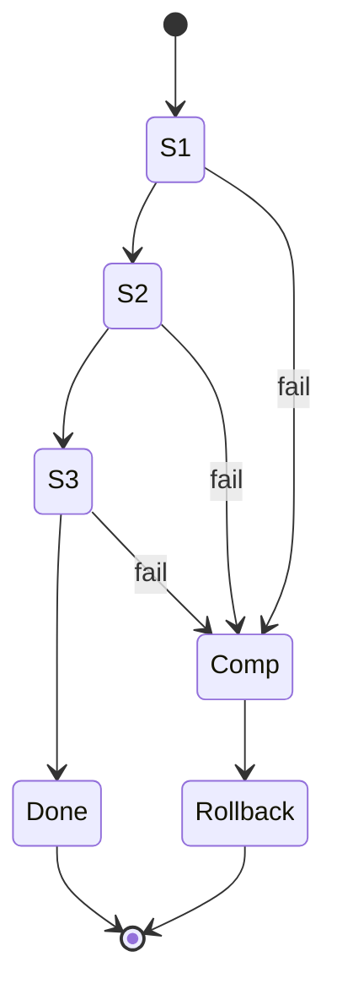


<a id="USllX"></a>
### 6.2 机制对比表


| 维度 | 前滚型（正向状态机） | 补偿型（正逆状态机） |
| --- | --- | --- |
| **步骤契约** | 只需 Execute | Execute + Compensate |
| **状态数量** | 步骤数 + 1（每步一态） | 步骤数 + 补偿态 + 终态 |
| **失败方向** | 停在当前态等重试 | 倒序进入补偿链 |
| **重试位置** | 当前失败步骤 | 补偿失败的步骤 |
| **对外结果** | 成功 / 处理中（无失败） | 成功 / 失败 / 补偿失败 |
| **数据可见性** | 中间态可见（长时间） | 中间态可见（短时间） |
| **幂等要求** | Execute 幂等 | Execute + Compensate 都幂等 |
| **兜底手段** | 后台 Job 推进 | 后台 Job 补偿 |
| **开发成本** | 低（每步一个方法） | 高（每步两个方法） |
| **调试难度** | 低（线性） | 中（分叉） |


<a id="BuWr3"></a>
### 6.3 选择决策树


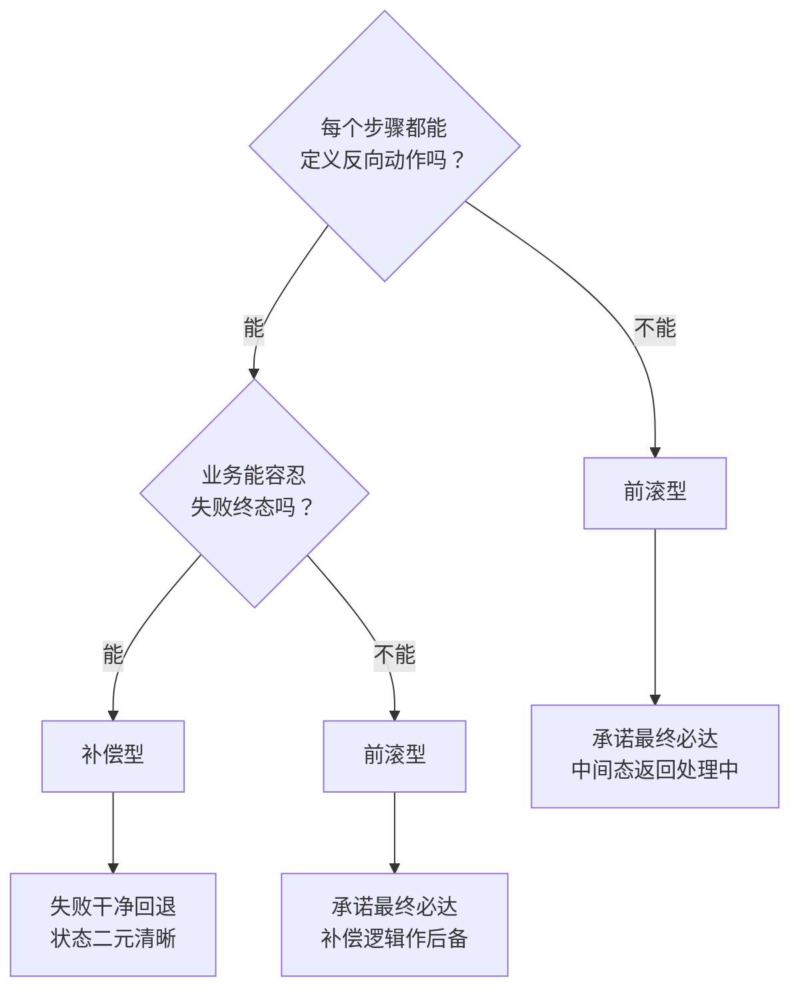


<a id="CgzS3"></a>
### 6.4 混合策略是常态


真实系统很少纯粹用一种：


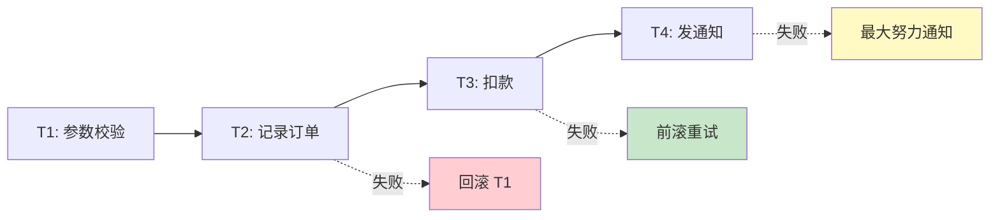


**分段策略**：


- 前置校验类步骤：**回滚**（代价小）

- 核心资金类步骤：**前滚**（不敢回滚）

- 后置通知类步骤：**最大努力通知**（失败可容忍）


---


<a id="FYmeS"></a>
## 七、Saga + 状态机 的工程实践清单


<a id="yfPwf"></a>
### 7.1 状态机设计的通用原则


**① 状态最少化**：每个状态必须有明确的业务语义，避免"看似有用其实没用"的中间状态。


**② 转移显式化**：所有合法的状态跳转都要写清楚，非法跳转必须被引擎拒绝。


**③ 终态明确**：至少要有 `SUCCESS` 和 `FAIL`（或 `COMPENSATED`）两个终态，避免"永远在路上"。


**④ 状态可持久化**：每次变更必须落库，掉电不丢。


<a id="DayqP"></a>
### 7.2 幂等设计的通用手法


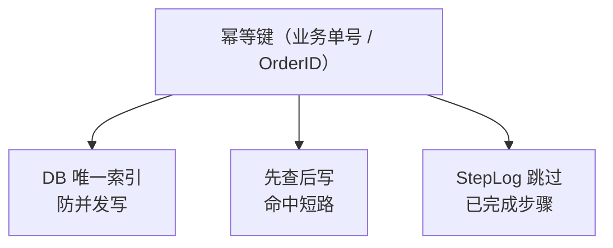


三层防御：**唯一索引兜底 + 应用查表短路 + 步骤级跳过**。


<a id="keqAq"></a>
### 7.3 补偿设计的注意事项


**① 补偿不是"反 SQL"**：不是 `UPDATE ... SET balance=balance-100` 的反向就是 `+100`。要考虑**并发下的中间变化**——补偿应该基于当时的操作痕迹，不是当前状态。


**② 空补偿要能处理**：如果 T1 还没执行就要补偿（比如 Try 阶段就失败），补偿动作要能识别"没做过所以不用撤销"。


**③ 补偿的幂等性同样重要**：定时兜底可能反复触发同一个补偿。


<a id="rsx3Q"></a>
### 7.4 兜底机制是必需品


任何异步系统都会有卡住的时候，**兜底 Job 是最后一道防线**：


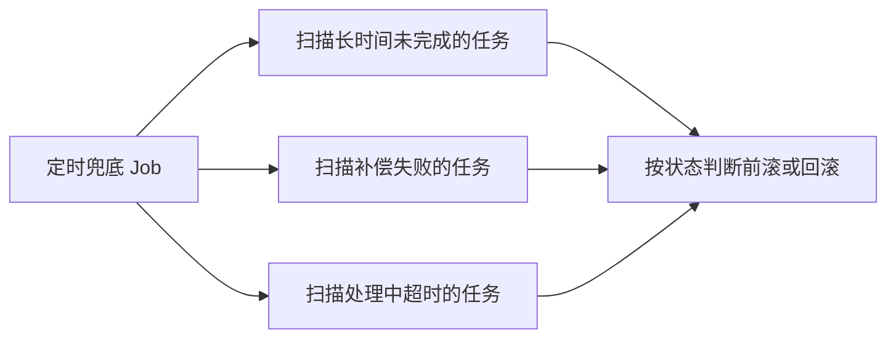


**没有兜底 Job 的 Saga 都是玩具**。


---


<a id="uUu1z"></a>
## 八、总结


<a id="xYSqS"></a>
### 8.1 三个核心命题


**Saga 的本质**：用"业务级的正逆步骤契约"替代 ACID 事务，牺牲隔离性和原子性，换取跨服务的可扩展和最终一致性。


**状态机的作用**：把 Saga 的"进度"物化，让流程崩溃可恢复、转移可校验、决策可自动。


**两种形态的区别**：不在于"用不用状态机"，而在于**状态机是单向前进还是可以分叉回退**——这背后是"前滚 vs 补偿"的哲学分歧。


<a id="wZ4UQ"></a>
### 8.2 一句话选型


- 步骤**可逆** + 业务**能接受失败** → **补偿型**（正逆状态机）

- 步骤**不可逆** + 业务**要求必达** → **前滚型**（正向状态机）

- 大多数真实系统 → **混合策略**，分段使用


<a id="jFyJO"></a>
### 8.3 工程铁律


不论选哪种：


1. **幂等键是根**——业务单号 + DB 唯一索引，不容妥协

2. **状态必须持久化**——每次变更立刻落库

3. **兜底 Job 必须有**——不能靠"应该不会出问题"活着

4. **中间态要可查**——出问题时能定位到"卡在哪一步"


**Saga 不是魔法，是纪律**。写得对不难，写得可靠很难。
